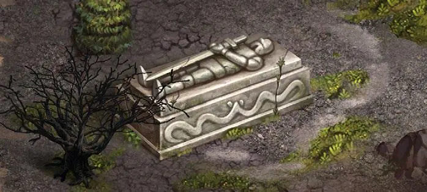

# Tumba del guerrero

<figure markdown="span">

{ width="475" align=right }

</figure>

___

[Lugar Visitable](../keywords/visitable_field.md)

___

**Search(2)** [Artifacts](../artifacts/index.md) twice, then gain :morale_negative: token twice.

___

## Ver También

- [Lista de Lugares](index.md)
- [Lista de Losetas](../tiles/index.md)
