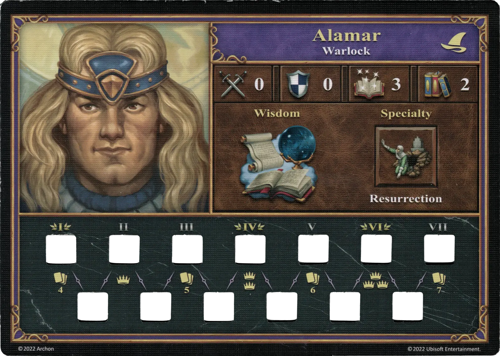
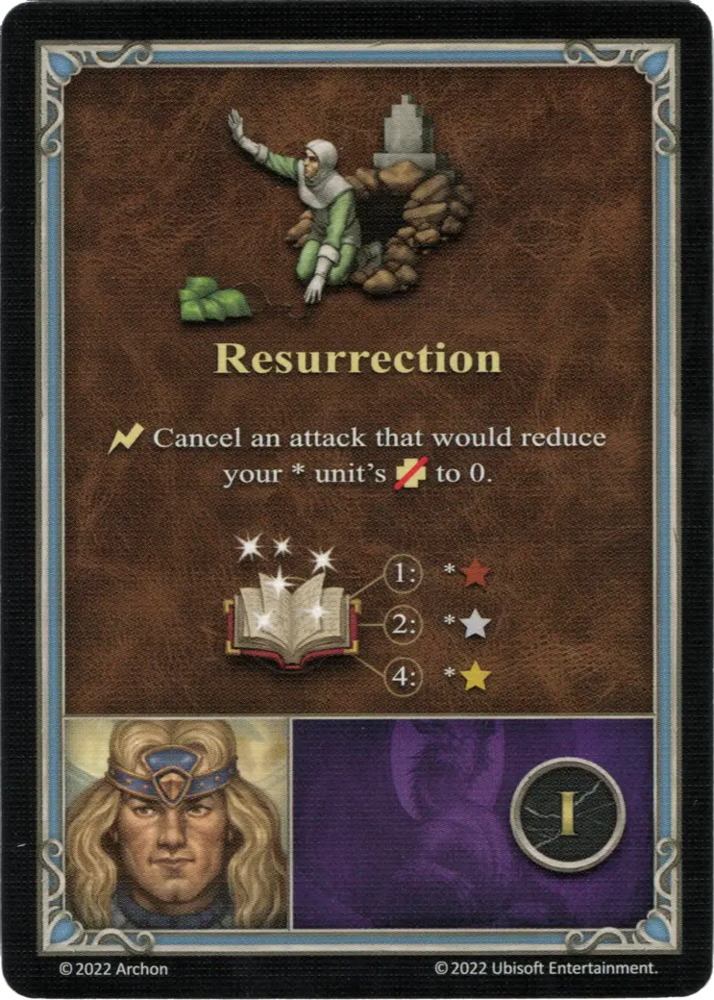
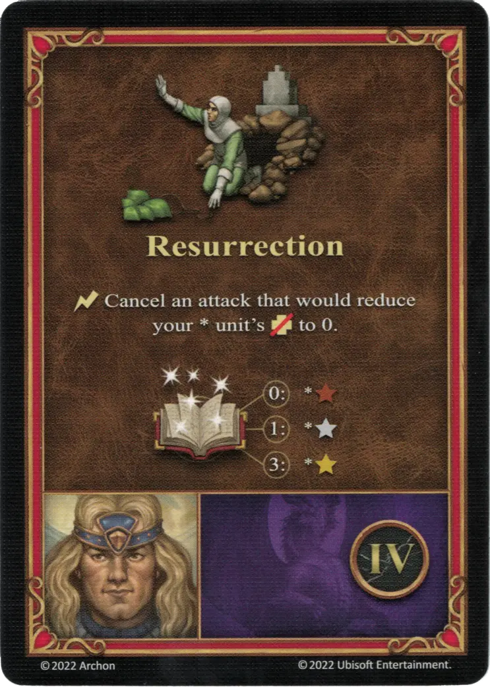
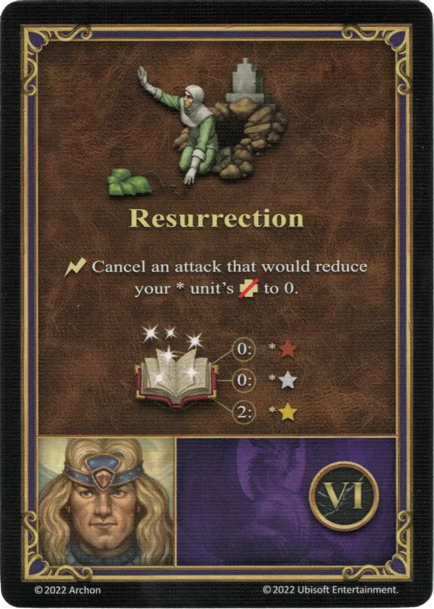

# Alamar

{ width=540 align=right }

___

[:magic: Brujo](index.md)

___

[Mazmorra](../towns/dungeon.md)

___

[:attack:](../statistics/attack.md)&nbsp;0 [:defense:](../statistics/defense.md)&nbsp;0 [:empower:](../statistics/power.md)&nbsp;3 [:skill:](../statistics/knowledge.md)&nbsp;2

___

[Sabiduría](../abilities/wisdom.md)

___

## Especialidad

=== "Resurrección Ⅰ"

    <figure markdown="span">
        { width="340" align=right }
    </figure>

=== "Resurrección Ⅳ"

    <figure markdown="span">
        { width="340" align=right }
    </figure>

=== "Resurrección Ⅵ"

    <figure markdown="span">
        { width="340" align=right }
    </figure>

| Nivel | Descripción |
| :---: | :---: |
| Ⅰ | :instant: Cancela un ataque que debería reducir los :health_points: de tu [unidad](../units/index.md) \* a 0.   :empower: 1 - \*:bronze: :empower: 2 - \*:silver: :empower: 4 - \*:golden: |
| Ⅳ | :instant: Cancela un ataque que debería reducir los :health_points: de tu [unidad](../units/index.md) \* a 0.   :empower: 0 - \*:bronze: :empower: 1 - \*:silver: :empower: 3 - \*:golden: |
| Ⅵ | :instant: Cancela un ataque que debería reducir los :health_points: de tu [unidad](../units/index.md) \* a 0.   :empower: 0 - \*:bronze: :empower: 0 - \*:silver: :empower: 2 - \*:golden: |

## Apariciones Como Héroe Jugador

- Sangre de Dragón - 2. Sangre del Padre Dragón
- Sangre de Dragón - 3. Sediento de Sangre

## Notas

- La especialidad se puede mejorar con el poder del hechizo, al igual que un hechizo normal.
- Ver [Hechizo Resurrección](../spells/resurrection.md)

## Viene Con

- [Juego Principal](../content/core_game.md)

## Ver También

- [Lista de Héroes](index.md)
- [Lista de Ciudades](../towns/index.md)

