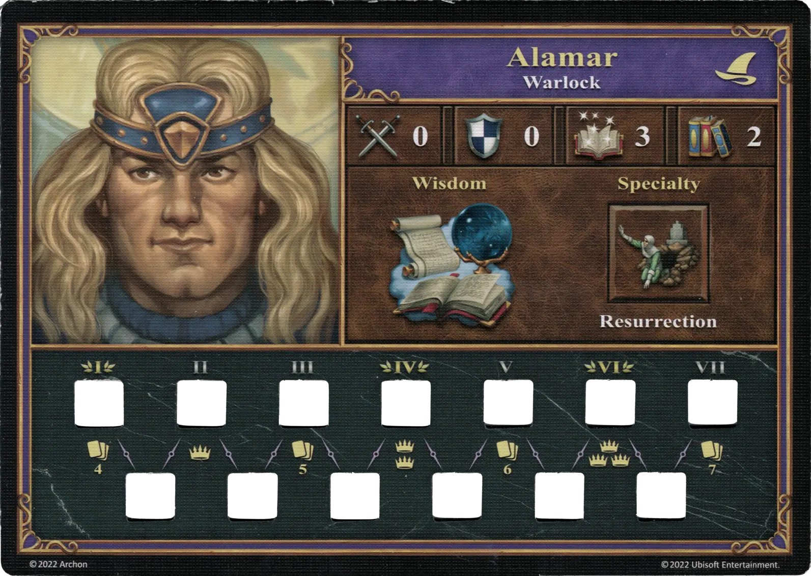
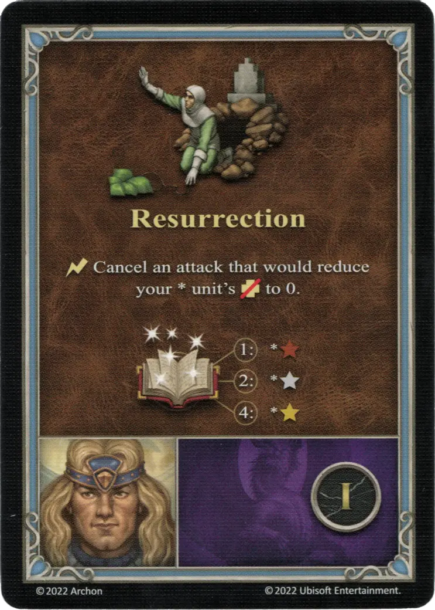
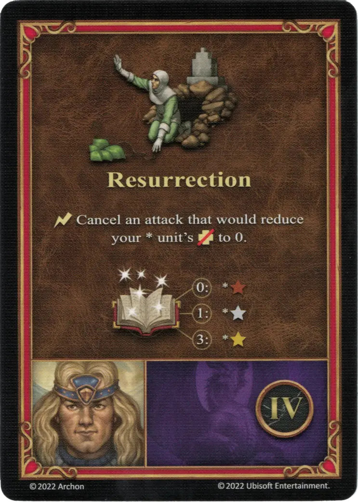
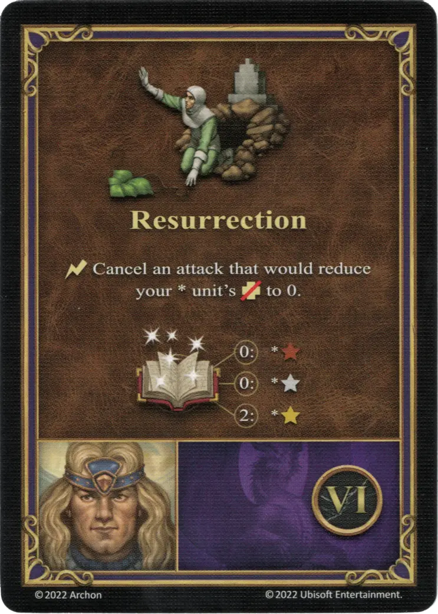

# Alamar

{ width=540 align=right }

___

[:magic: Brujo](index.md)

___

[Mazmorra](../towns/dungeon.md)

___

[:attack:](../statistics/attack.md)&nbsp;0 [:defense:](../statistics/defense.md)&nbsp;0 [:power:](../statistics/power.md)&nbsp;3 [:knowledge:](../statistics/knowledge.md)&nbsp;2

___

[Sabiduría](../abilities/wisdom.md)

___

## Especialidad

=== "Resurrección Ⅰ"

    <figure markdown="span">
        { width="340" align=right }
    </figure>

=== "Resurrección Ⅳ"

    <figure markdown="span">
        { width="340" align=right }
    </figure>

=== "Resurrección Ⅵ"

    <figure markdown="span">
        { width="340" align=right }
    </figure>

| Level | Description |
| :---: | :---: |
| Ⅰ | :instant: Cancel an attack that would reduce your \* [unit's](../units/index.md) :health_points: to 0.   :power: 1 - \*:bronze_tier: :power: 2 - \*:silver_tier: :power: 4 - \*:gold_tier: |
| Ⅳ | :instant: Cancel an attack that would reduce your \* [unit's](../units/index.md) :health_points: to 0.   :power: 0 - \*:bronze_tier: :power: 1 - \*:silver_tier: :power: 3 - \*:gold_tier: |
| Ⅵ | :instant: Cancel an attack that would reduce your \* [unit's](../units/index.md) :health_points: to 0.   :power: 0 - \*:bronze_tier: :power: 0 - \*:silver_tier: :power: 2 - \*:gold_tier: |

## Apariciones Como Héroe Jugador

- Sangre de Dragón - 2. Sangre del Padre Dragón
- Sangre de Dragón - 3. Sediento de Sangre

## Notas

- La especialidad se puede mejorar con el poder del hechizo, al igual que un hechizo normal.
- Ver [Hechizo Resurrección](../spells/resurrection.md)

## Viene Con

- [Juego Principal](../content/core_game.md)

## Ver También

- [Lista de Héroes](index.md)
- [Lista de Ciudades](../towns/index.md)

