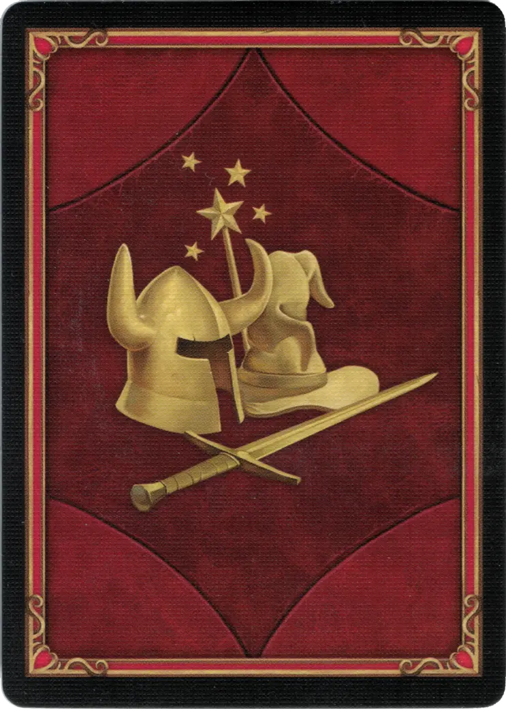

# Cassiopeia

{ width=340 align=right }

___

[:might: Capitán](index.md)

___

[Ensenada](../towns/cove.md)

___

[:attack:](../statistics/attack.md)&nbsp;3 [:defense:](../statistics/defense.md)&nbsp;0 [:empower:](../statistics/power.md)&nbsp;2 [:skill:](../statistics/knowledge.md)&nbsp;1

___

[Táctica](../abilities/tactics.md)

___

## Especialidad

=== "Oceánidas Ⅰ"

    <figure markdown="span">
        { width="340" align=right }
    </figure>

=== "Oceánidas Ⅳ"

    <figure markdown="span">
        { width="340" align=right }
    </figure>

=== "Oceánidas Ⅵ"

    <figure markdown="span">
        { width="340" align=right }
    </figure>

| Nivel | Descripción |
| :---: | :---: |
| Ⅰ | 🚧 |
| Ⅳ | 🚧 |
| Ⅵ | 🚧 |

## Viene Con

- [Expansión de Ensenada](../content/cove_expansion.md)

## Ver También

- [Lista de Héroes](index.md)
- [Lista de Ciudades](../towns/index.md)

