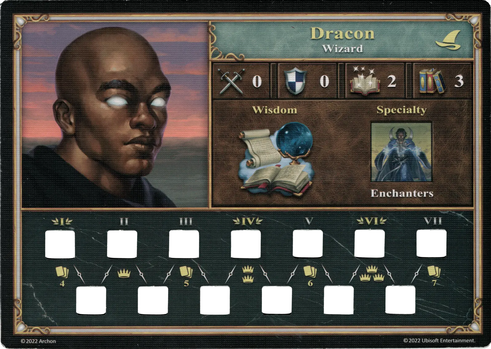
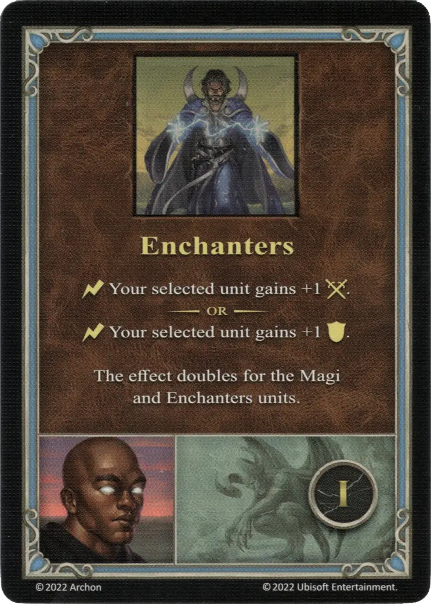
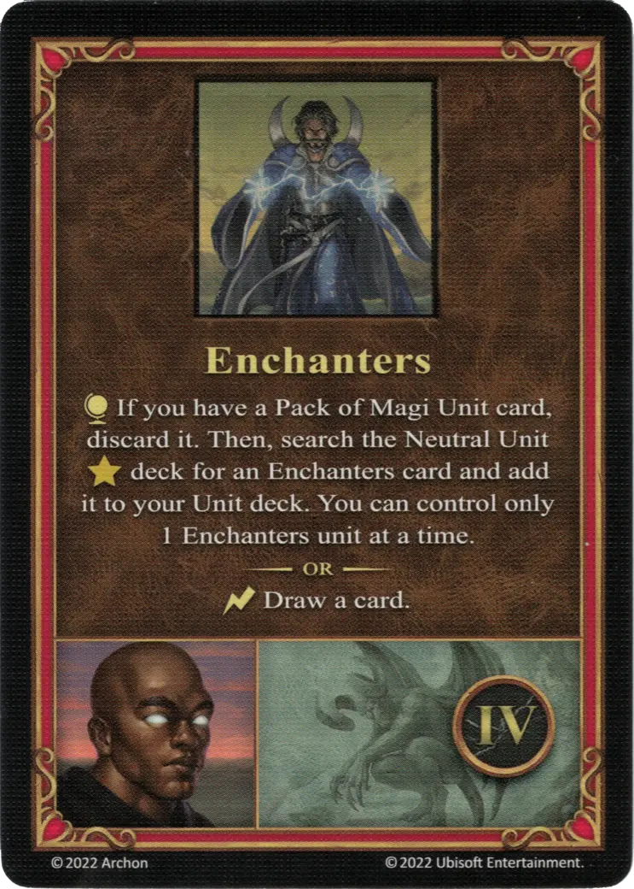
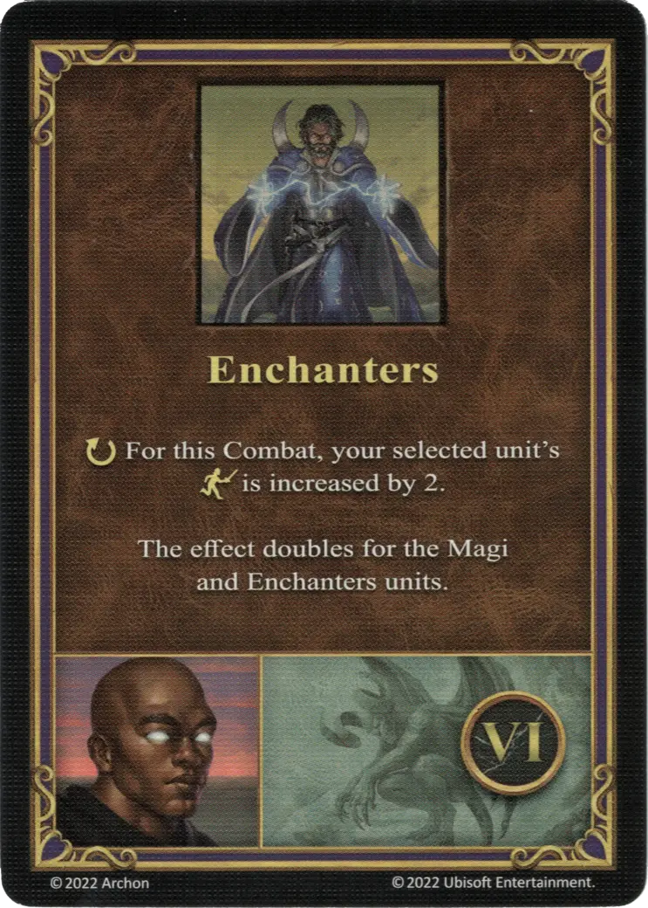

# Dracon

{ width=540 align=right }

___

[:magic: Hechicero](index.md)

___

[Torre](../towns/tower.md)

___

[:attack:](../statistics/attack.md)&nbsp;0 [:defense:](../statistics/defense.md)&nbsp;0 [:power:](../statistics/power.md)&nbsp;2 [:knowledge:](../statistics/knowledge.md)&nbsp;3

___

[Sabiduría](../abilities/wisdom.md)

___

## Especialidad

=== "Conjuradores Ⅰ"

    <figure markdown="span">
        { width="340" align=right }
    </figure>

=== "Conjuradores Ⅳ"

    <figure markdown="span">
        { width="340" align=right }
    </figure>

=== "Conjuradores Ⅵ"

    <figure markdown="span">
        { width="340" align=right }
    </figure>

| Level | Description |
| :---: | :---: |
| Ⅰ | :instant: Your selected [unit](../units/index.md) gains +1 :attack:  — OR —  :instant: Your selected [unit](../units/index.md) gains +1 :defense:  This effect doubles for the [Magi](../units/magi.md) and [Enchanters units](../units/enchanters.md). |
| Ⅳ | :map_effect: If you have a [Pack of Magi Unit](../units/magi.md) card, discard it. Then, search the [Neutral Unit](../units/index.md) :gold_tier: deck for the [Enchanters](../units/enchanters.md) card and add it to your Unit deck. You can control only 1 [Enchanters unit](../units/enchanters.md) at a time.  — OR —  :instant: Draw a card. |
| Ⅵ | :ongoing: For this Combat, your selected [unit's](../units/index.md) :initiative: is increased by 2.  This effect doubles for the [Magi](../units/magi.md) and [Enchanters units](../units/enchanters.md). |

## Apariciones

- The Dragon Slayer - 1. Crystal Dragons
- The Dragon Slayer - 2. Rust Dragons
- The Dragon Slayer - 3. Faerie Dragons
- The Dragon Slayer - 4. Azure Dragons

## Viene Con

- [Expansión de Torre](../content/tower_expansion.md)

## Ver También

- [Lista de Héroes](index.md)
- [Lista de Ciudades](../towns/index.md)

