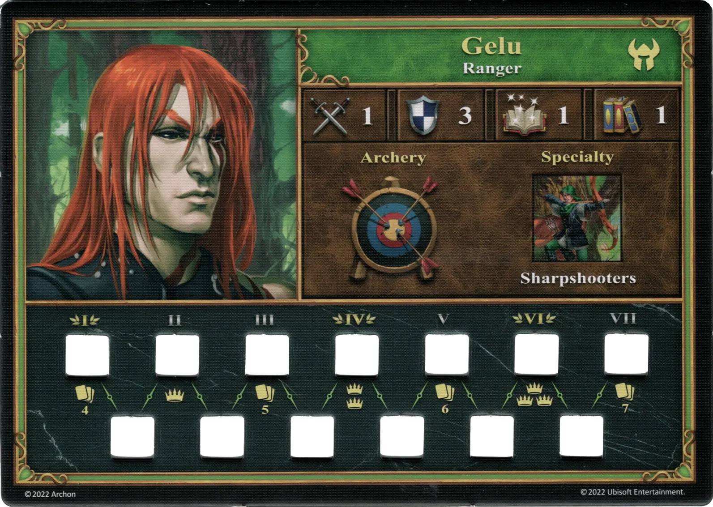
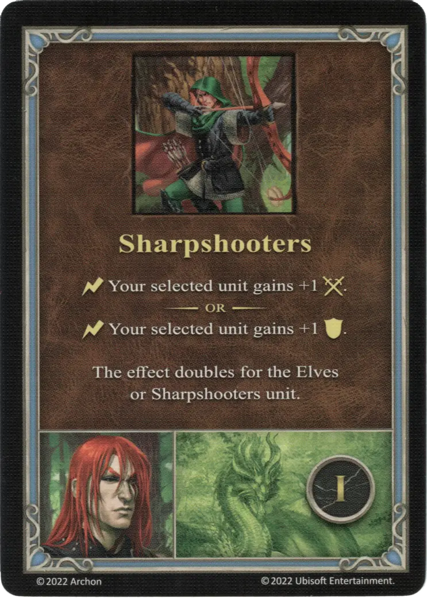
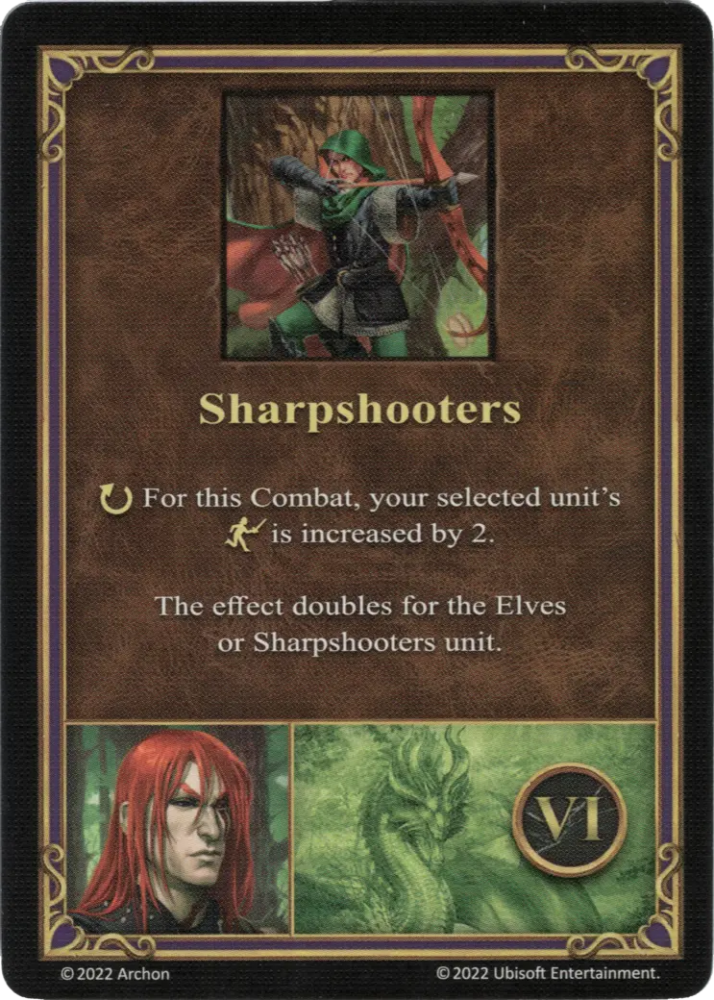

# Gelu

{ width=540 align=right }

___

[:might: Guardabosques](index.md)

___

[Murallas](../towns/rampart.md)

___

[:attack:](../statistics/attack.md)&nbsp;1 [:defense:](../statistics/defense.md)&nbsp;3 [:power:](../statistics/power.md)&nbsp;1 [:knowledge:](../statistics/knowledge.md)&nbsp;1

___

[Tiro con Arco](../abilities/archery.md)

___

## Especialidad

=== "Tiradores Certeros Ⅰ"

    <figure markdown="span">
        { width="340" align=right }
    </figure>

=== "Tiradores Certeros Ⅳ"

    <figure markdown="span">
        { width="340" align=right }
    </figure>

=== "Tiradores Certeros Ⅵ"

    <figure markdown="span">
        { width="340" align=right }
    </figure>

| Level | Description |
| :---: | :---: |
| Ⅰ | :instant: Your selected [unit](../units/index.md) gains +1 :attack:  — OR —  :instant: Your selected [unit](../units/index.md) gains +1 :defense:  This effect doubles for the [Elves](../units/elves.md) and [Sharpshooters units](../units/sharpshooters.md). |
| Ⅳ | :map_effect: If you have a [Pack of Elves Unit](../units/elves.md) card, discard it. Then, search the [Neutral Unit](../units/index.md) :silver_tier: deck for the [Sharpshooters](../units/sharpshooters.md) card and add it to your [Unit](../units/index.md) deck. You can control only 1 [Sharpshooters](../units/sharpshooters.md) [unit](../units/index.md) at a time.  — OR —  :instant: Draw a card. |
| Ⅵ | :ongoing: For this Combat, your selected [unit's](../units/index.md) :initiative: is increased by 2.  This effect doubles for the [Elves](../units/elves.md) and [Sharpshooters units](../units/sharpshooters.md). |

## Apariciones Como Héroe Jugador

- Venganza a Sangre Fría - 1. Búsqueda de un Asesino
- Dead-cold Revenge - 3. Agents Of Vengeance

## Viene Con

- [Expansión de Muralla](../content/rampart_expansion.md)

## Ver También

- [Lista de Héroes](index.md)
- [Lista de Ciudades](../towns/index.md)

