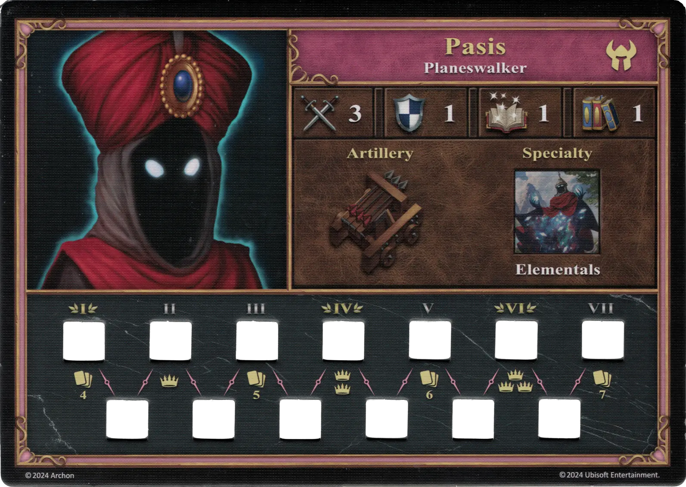
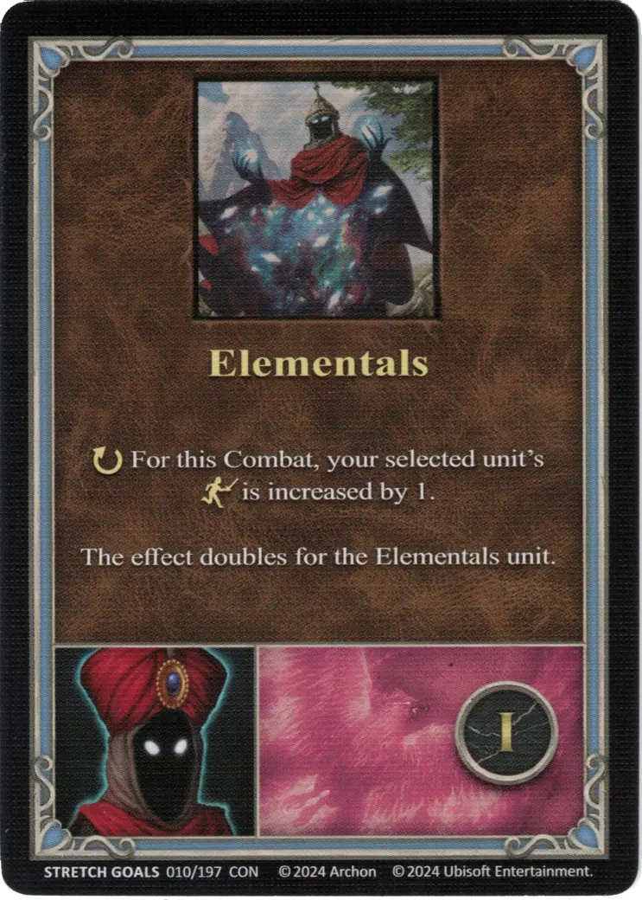
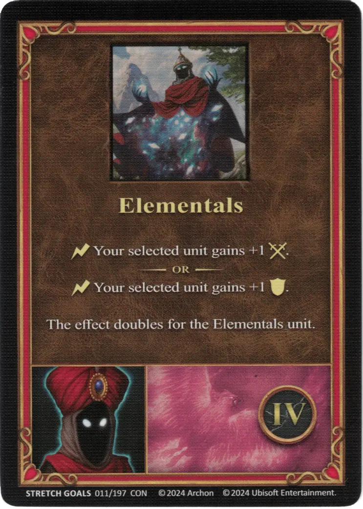
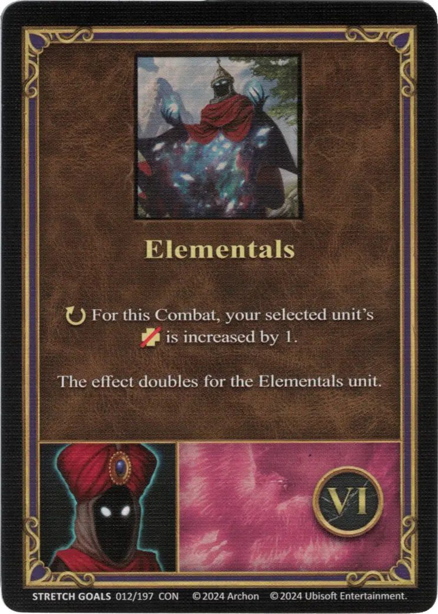

# Han pasado

{ width=540 align=right }

___

[:might: Caminante de Planos](index.md)

___

[Conflujo](../towns/conflux.md)

___

[:attack:](../statistics/attack.md)&nbsp;3 [:defense:](../statistics/defense.md)&nbsp;1 [:power:](../statistics/power.md)&nbsp;1 [:knowledge:](../statistics/knowledge.md)&nbsp;1

___

[Artillería](../abilities/artillery.md)

___

## Especialidad

=== "Elementals Ⅰ"

    <figure markdown="span">
        { width="340" align=right }
    </figure>

=== "Elementals Ⅳ"

    <figure markdown="span">
        { width="340" align=right }
    </figure>

=== "Elementals Ⅵ"

    <figure markdown="span">
        { width="340" align=right }
    </figure>

| Level | Description |
| :---: | :---: |
| Ⅰ | :ongoing: For this Combat, your selected [unit's](../units/index.md) :initiative: is increased by 1.  The effect doubles for the Elementals unit. |
| Ⅳ | :instant: Your selected [unit](../units/index.md) gains +1 :attack:.  — OR —  :instant: Your selected [unit](../units/index.md) gains +1 :defense:.  The effect doubles for the Elementals unit. |
| Ⅵ | :ongoing: For this Combat, your selected [unit's](../units/index.md) :health_points: is increased by 1.  The effect doubles for the Elementals unit. |

## Notas

- Any unit with the word "Elementals" in their name counts as an Elementals unit.

## Viene Con

- [Metas Ampliadas Regulares 2024](../content/regular_stretch_goals.md)

## Ver También

- [Lista de Héroes](index.md)
- [Lista de Ciudades](../towns/index.md)

