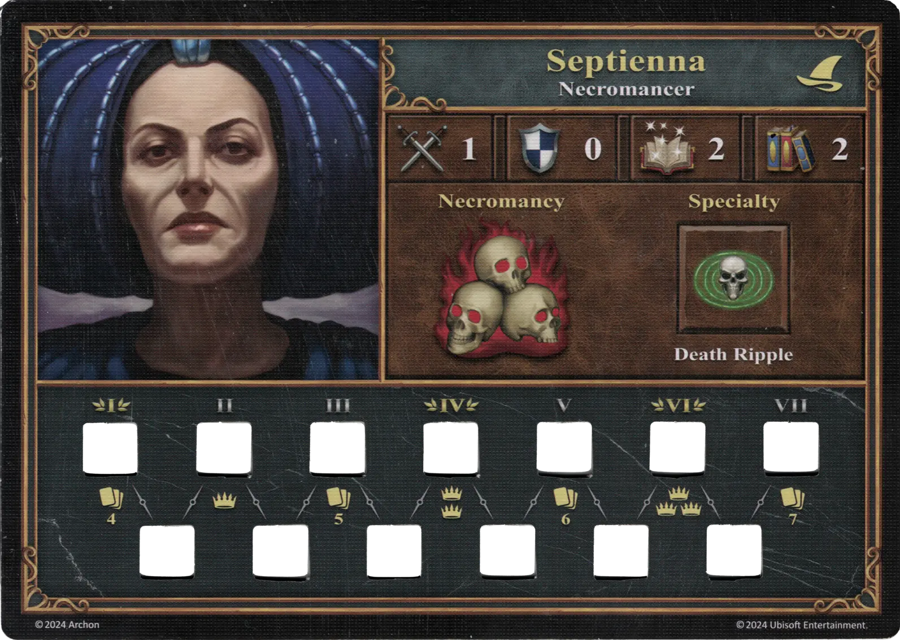
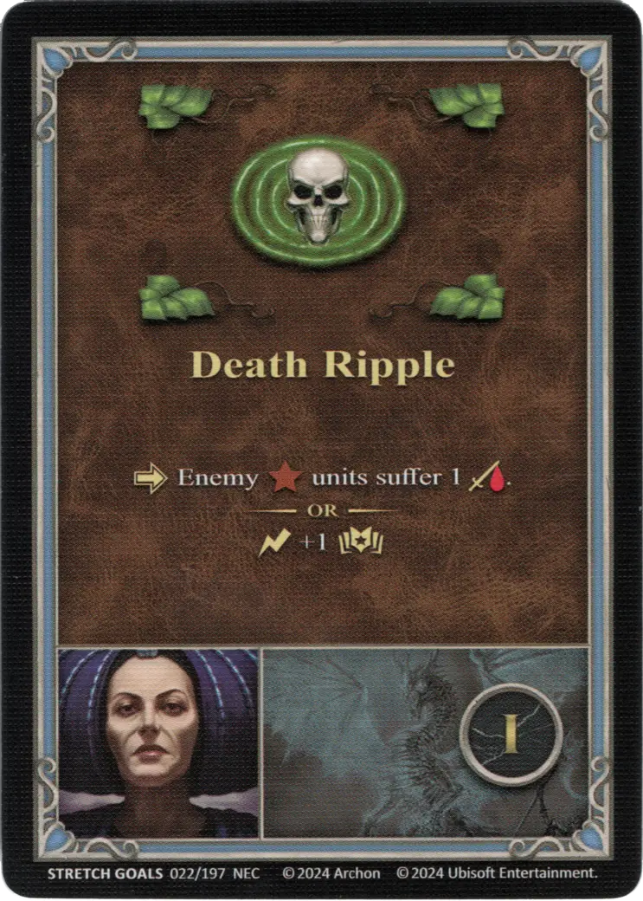
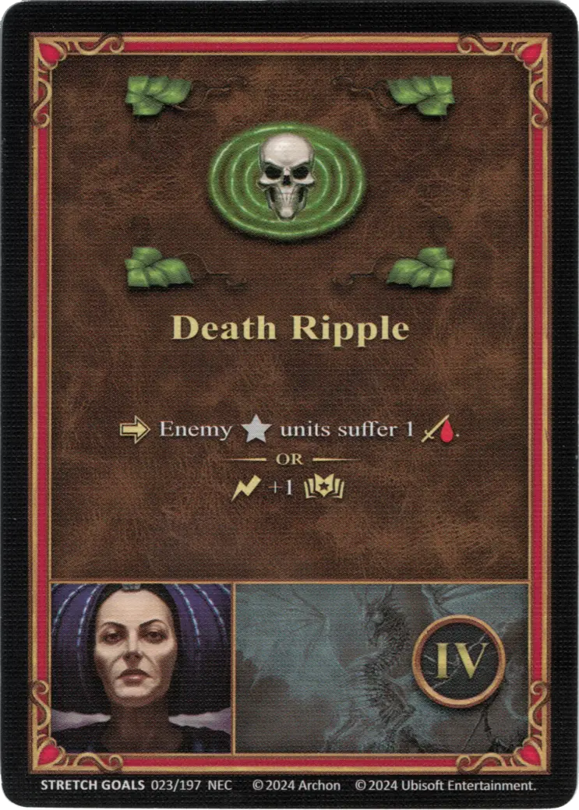
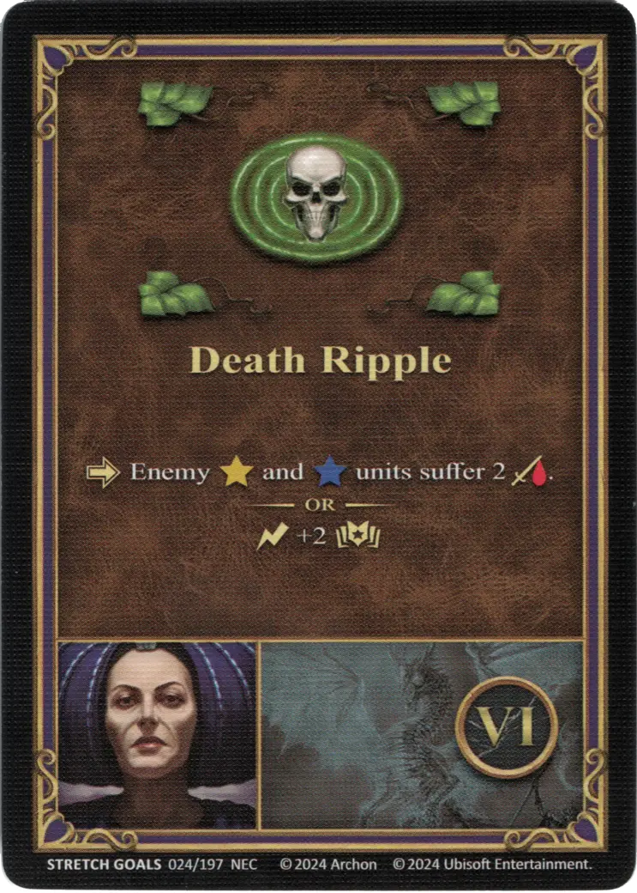

# Septienna

{ width=540 align=right }

___

[:magic: Necromancer](index.md)

___

[Necropolis](../towns/necropolis.md)

___

[:attack:](../statistics/attack.md)&nbsp;1 [:defense:](../statistics/defense.md)&nbsp;0 [:power:](../statistics/power.md)&nbsp;2 [:knowledge:](../statistics/knowledge.md)&nbsp;2

___

[Nigromancia](../abilities/necromancy.md)

___

## Especialidad

=== "Death Ripple ⅰ"

    <figure markdown="span">
        { width="340" align=right }
    </figure>

=== "Death Ripple ⅳ"

    <figure markdown="span">
        { width="340" align=right }
    </figure>

=== "Death Ripple ⅵ"

    <figure markdown="span">
        { width="340" align=right }
    </figure>

| Level | Description |
| :---: | :---: |
| Ⅰ | :activation: Enemy :bronze_tier: [units](../units/index.md) suffer 1 :damage:.  — OR —  :instant: +1 :power: |
| Ⅳ | :activation: Enemy :silver_tier: [units](../units/index.md) suffer 1 :damage:.  — OR —  :instant: +1 :power: |
| Ⅵ | :activation: Enemy :gold_tier: and :azure_tier: [units](../units/index.md) suffer 2 :damage:.  — OR —  :instant: +2 :power: |

## Viene Con

- [Metas Ampliadas Regulares 2024](../content/regular_stretch_goals.md)

## Ver También

- [Lista de Héroes](index.md)
- [Lista de Ciudades](../towns/index.md)

