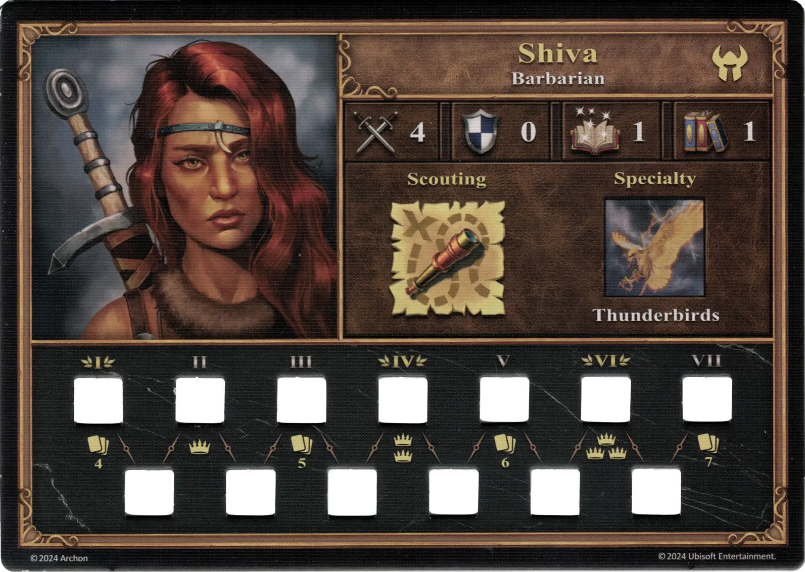
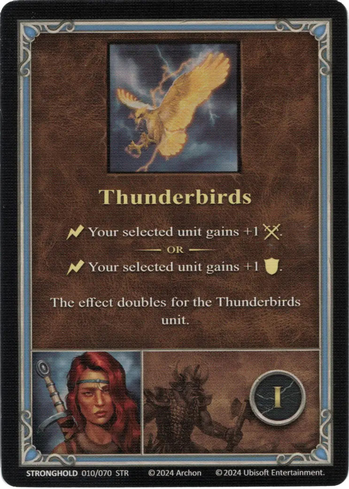
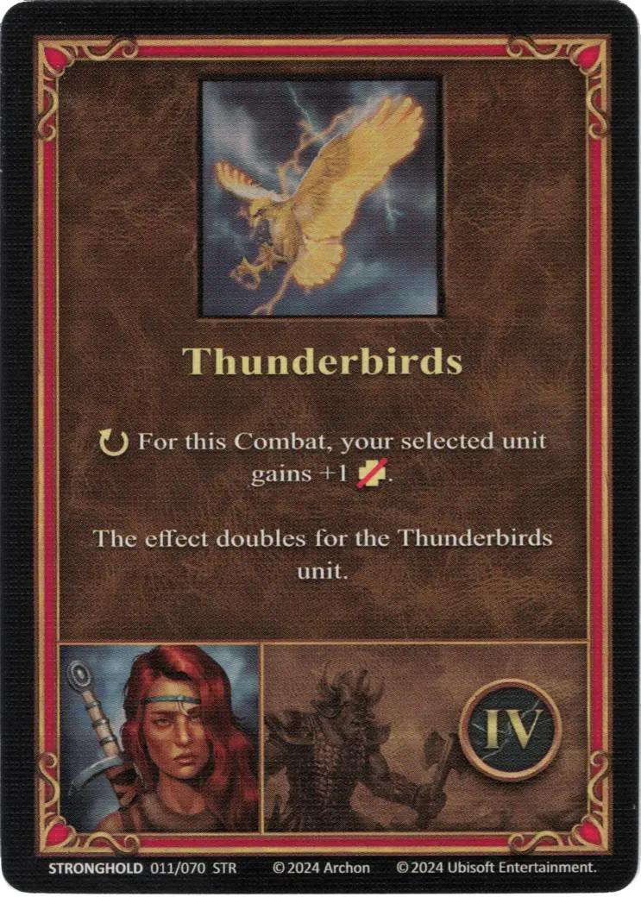
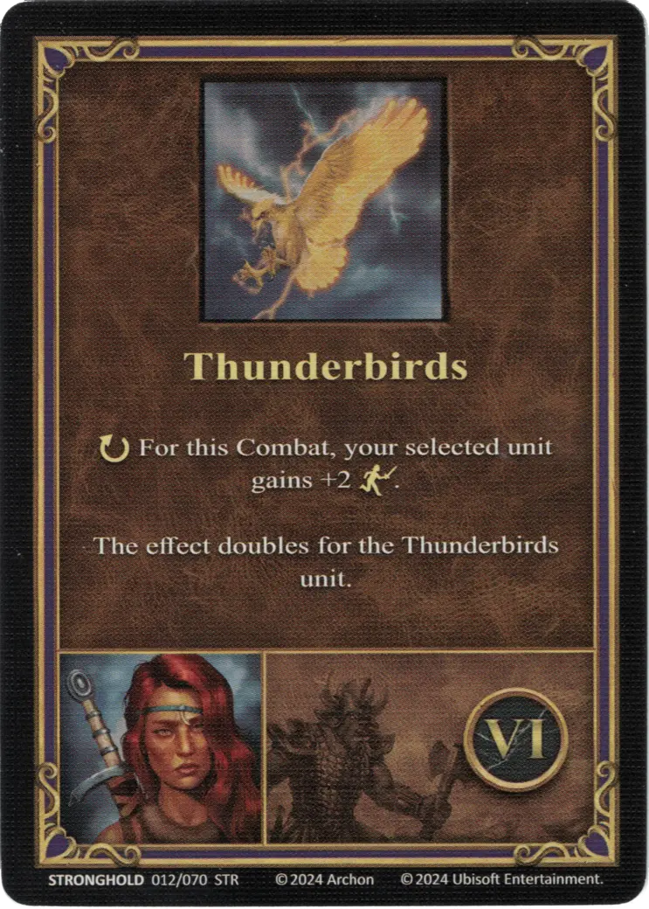

# Shiva

{ width=540 align=right }

___

[:might: Bárbaro](index.md)

___

[Bastión](../towns/stronghold.md)

___

[:attack:](../statistics/attack.md)&nbsp;4 [:defense:](../statistics/defense.md)&nbsp;0 [:power:](../statistics/power.md)&nbsp;1 [:knowledge:](../statistics/knowledge.md)&nbsp;1

___

[Exploración](../abilities/scouting.md)

___

## Especialidad

=== "Thunderbirds ⅰ"

    <figure markdown="span">
        { width="340" align=right }
    </figure>

=== "Thunderbirds ⅳ"

    <figure markdown="span">
        { width="340" align=right }
    </figure>

=== "Thunderbirds ⅵ"

    <figure markdown="span">
        { width="340" align=right }
    </figure>

| Level | Description |
| :---: | :---: |
| Ⅰ | :instant: Your selected [unit](../units/index.md) gains +1 :attack:.  — OR —  :instant: Your selected [unit](../units/index.md) gains +1 :defense:.  The effect doubles for the [Thunderbirds unit](../units/thunderbirds.md). |
| Ⅳ | :ongoing: For this Combat, your selected [unit](../units/index.md) gains +1 :health_points:.  The effect doubles for the [Thunderbirds unit](../units/thunderbirds.md). |
| Ⅵ | :ongoing: For this Combat, your selected [unit](../units/index.md) gains +2 :initiative:.  The effect doubles for the [Thunderbirds unit](../units/thunderbirds.md).|

## Apariciones como héroe enemigo

- Aumento del nigromante - 1. Target

## Viene Con

- [Expansión de Bastión](../content/stronghold_expansion.md)

## Ver También

- [Lista de Héroes](index.md)
- [Lista de Ciudades](../towns/index.md)

