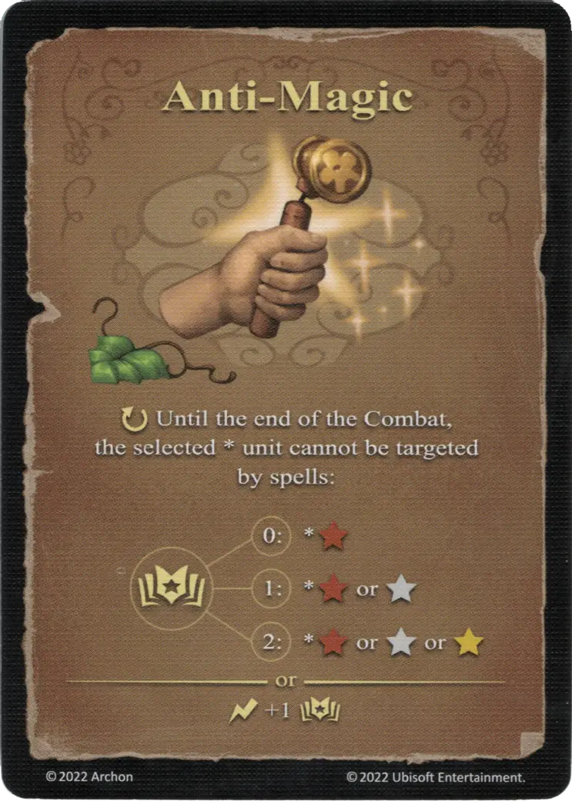

# Anti-Magia

{ width="340" align=right }

___

[Hechizo Básico de Tierra](school_of_earth_magic.md)

___

:ongoing: Hasta el final del Combate, la [unidad](../units/index.md) \* seleccionada no puede ser objetivo de hechizos:  :empower: 0 ➣ \*:bronze: :empower: 2 ➣ \*:bronze: o :silver: :empower: 4 ➣ \*:bronze: o :silver: o :golden:  — O —  :instant: +1 :empower:

___

## Notas

- Las Unidades que están protegidas de hechizos mediante Anti-Magia son también inmunes a los efectos de área de hechizos (ej. [hechizo Bola de Fuego](../spells/fireball.md)).

## Viene Con

- [Juego Principal](../content/core_game.md)

## Ver También

- [Escuela de Magia Terrestre](school_of_earth_magic.md)
- [Lista de Hechizos](index.md)
