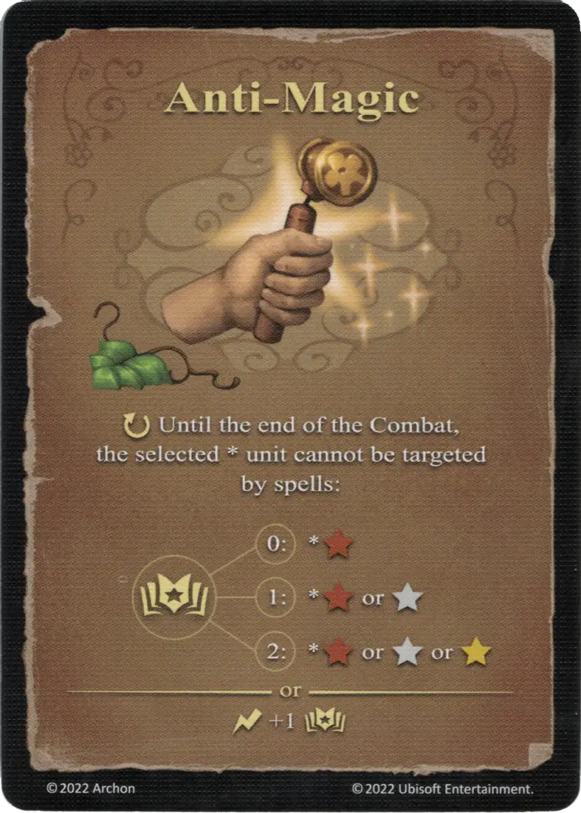

# Anti-Magia

{ width="340" align=right }

___

[Hechizo Básico de Tierra](index.md#school-of-earth-magic)

___

:ongoing: Until the end of the Combat, the selected \* [unit](../units/index.md) cannot be targeted by spells:  :power: 0 ➣ \*:bronze_tier: :power: 2 ➣ \*:bronze_tier: or :silver_tier: :power: 4 ➣ \*:bronze_tier: or :silver_tier: or :gold_tier:  — OR —  :instant: +1 :power:

___

## Notas

- Las Unidades que están protegidas de hechizos mediante Anti-Magia son también inmunes a los efectos de área de hechizos (ej. [hechizo Bola de Fuego](../spells/fireball.md)).

## Viene Con

- [Juego Principal](../content/core_game.md)

## Ver También

- [Escuela de Magia Terrestre](index.md#school-of-earth-magic)
- [Lista de Hechizos](index.md)
