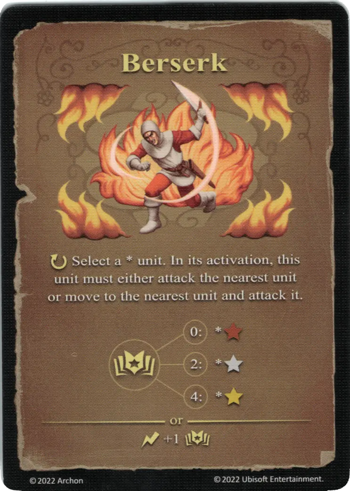

# Locura

{ width="340" align=right }

___

[Hechizo de Fuego Experto](school_of_fire_magic.md)

___

:ongoing: Selecciona una \* [unidad](../units/index.md). En su activación, esta [unidad](../units/index.md) debe atacar a la [unidad](../units/index.md) más cercana o moverse hacia la [unit](../units/index.md) más cercana y atacarla.  :empower: 0 ➣ \*:bronze: :empower: 2 ➣ \*:silver: :empower: 4 ➣ \*:golden:  — OR —  :instant: +1 :empower:

___

## Notas

- Si hay varias unidades cercanas a la misma distancia de la unidad bajo este hechizo, el jugador que posee la unidad decide la dirección del movimiento y el objetivo del ataque.
- Las unidades aliadas también pueden ser atacadas por la unidad bajo este hechizo.
- El ataque de la unidad bajo este hechizo desencadena un ataque de represalia, incluso si la unidad atacada fue aliada.

## Viene Con

- [Expansión de Torre](../content/tower_expansion.md)

## Ver También

- [Escuela de Magia Ígnea](school_of_fire_magic.md)
- [Lista de Hechizos](index.md)
