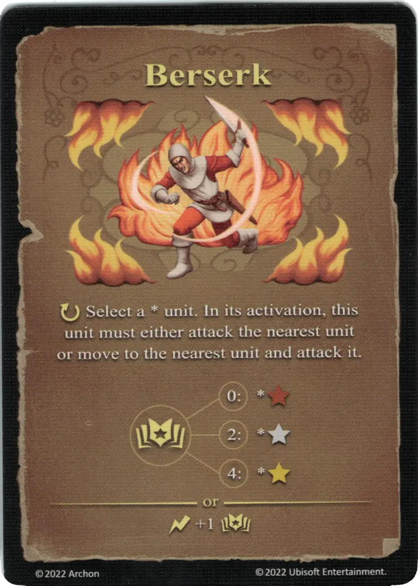

# Locura

{ width="340" align=right }

___

[Hechizo de Fuego Experto](index.md#school-of-fire-magic)

___

:ongoing: Select a \* [unit](../units/index.md). In its activation, this [unit](../units/index.md) must either attack the nearest [unit](../units/index.md) or move to the nearest [unit](../units/index.md) and attack it.  :power: 0 ➣ \*:bronze_tier: :power: 2 ➣ \*:silver_tier: :power: 4 ➣ \*:gold_tier:  — OR —  :instant: +1 :power:

___

## Notas

- Si hay varias unidades cercanas a la misma distancia de la unidad bajo este hechizo, el jugador que posee la unidad decide la dirección del movimiento y el objetivo del ataque.
- Las unidades aliadas también pueden ser atacadas por la unidad bajo este hechizo.
- El ataque de la unidad bajo este hechizo desencadena un ataque de represalia, incluso si la unidad atacada fue aliada.

## Viene Con

- [Expansión de Torre](../content/tower_expansion.md)
- [Metas Ampliadas Regulares 2024](../content/regular_stretch_goals.md)

## Ver También

- [Escuela de Magia Ígnea](index.md#school-of-fire-magic)
- [Lista de Hechizos](index.md)
