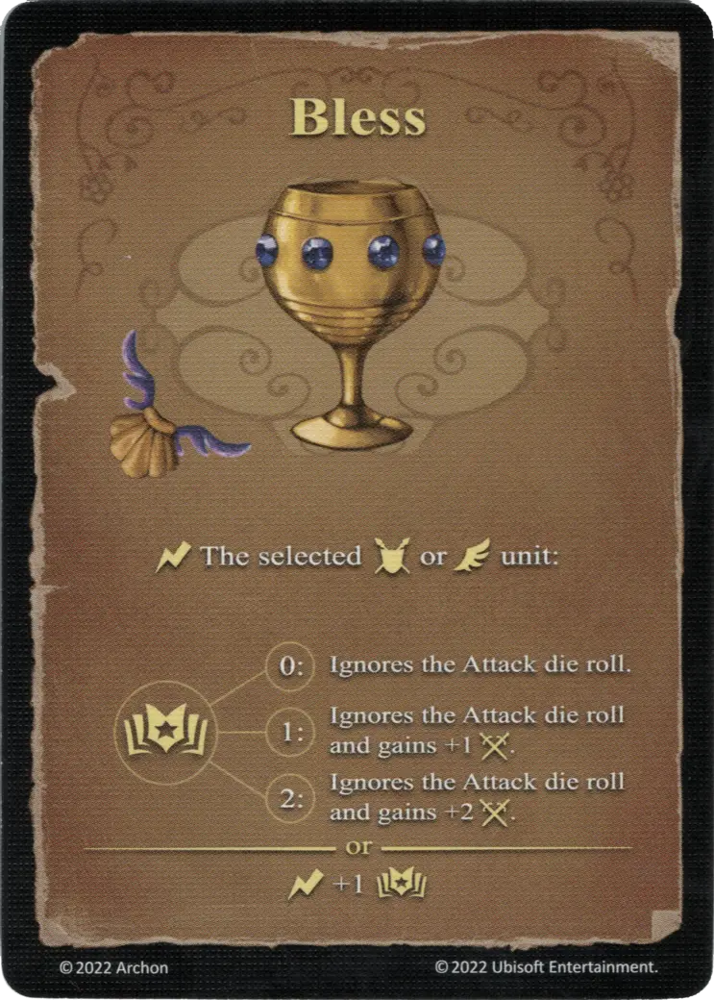

# Bendecir

{ width="340" align=right }

___

[Hechizo Básico de Agua](school_of_water_magic.md)

___

:instant: La :unit: de :unit_ground: o :unit_flying: seleccionada  :empower: 0 ➣ Ignora la tirada del [dado de Ataque](../keywords/dice.md#attack-die). :empower: 1 ➣ Ignora la tirada del [dado de Ataque](../keywords/dice.md#attack-die) y gana +1 :attack: :empower: 2 ➣ Ignora la tirada del [dado de Ataque](../keywords/dice.md#attack-die) y gana +2 :attack:  — O —  :instant: +1 :empower:

___

## Notas

- Si no se tira ningún dado de Ataque durante el ataque, tampoco se muestra ningún resultado. Esto significa que las unidades que tienen habilidades basadas en el resultado de una tirada de Ataque no se activan. (ej. la :defensa: de los Zombis no aumenta, y las Momias no pueden poner el dado de Ataque a «-1»).

## Viene Con

- [Juego Principal](../content/core_game.md)

## Ver También

- [Escuela de Magia Acuática](school_of_water_magic.md)
- [Lista de Hechizos](index.md)
