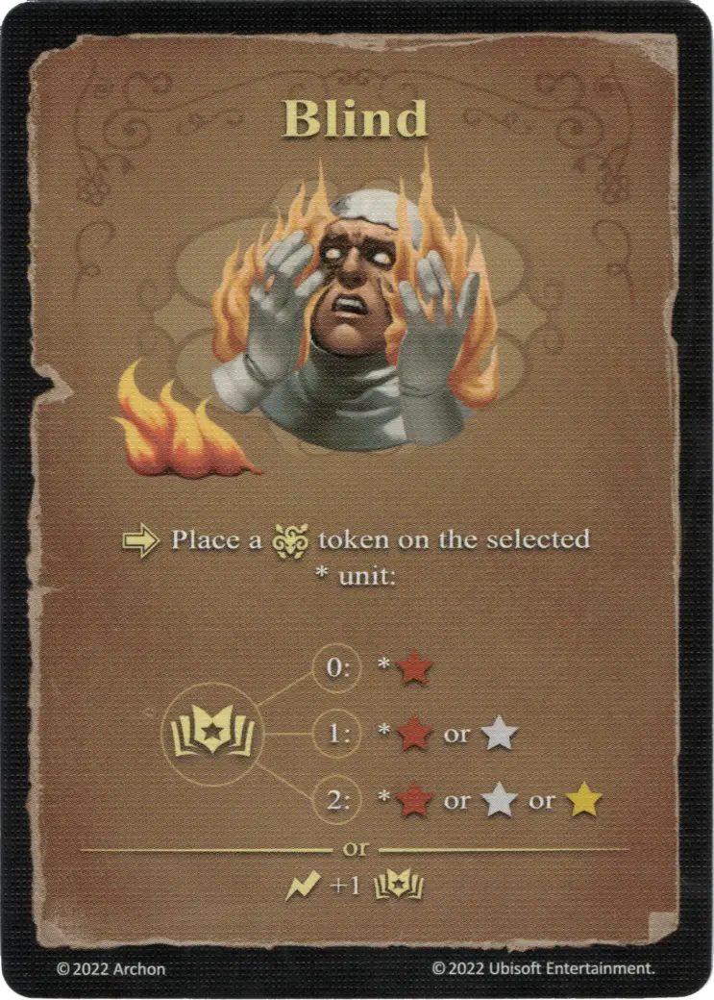

# Cegar

{ width="340" align=right }

___

[Hechizo Básico de Fuego](school_of_fire_magic.md)

___

:activation: Coloca una ficha de :paralysis: sobre la [unidad](../units/index.md) \* seleccionada:  :empower: 0 ➣ \*:bronze: :empower: 1 ➣ \*:bronze: o :silver: :empower: 2 ➣ \*:bronze: o :silver: o :golden:  — O —  :instant: +1 :empower:

___

## Notas

- Ver [Parálisis](../keywords/paralysis.md)

## Viene Con

- [Juego Principal](../content/core_game.md)

## Ver También

- [Escuela de Magia Ígnea](school_of_fire_magic.md)
- [Lista de Hechizos](index.md)
