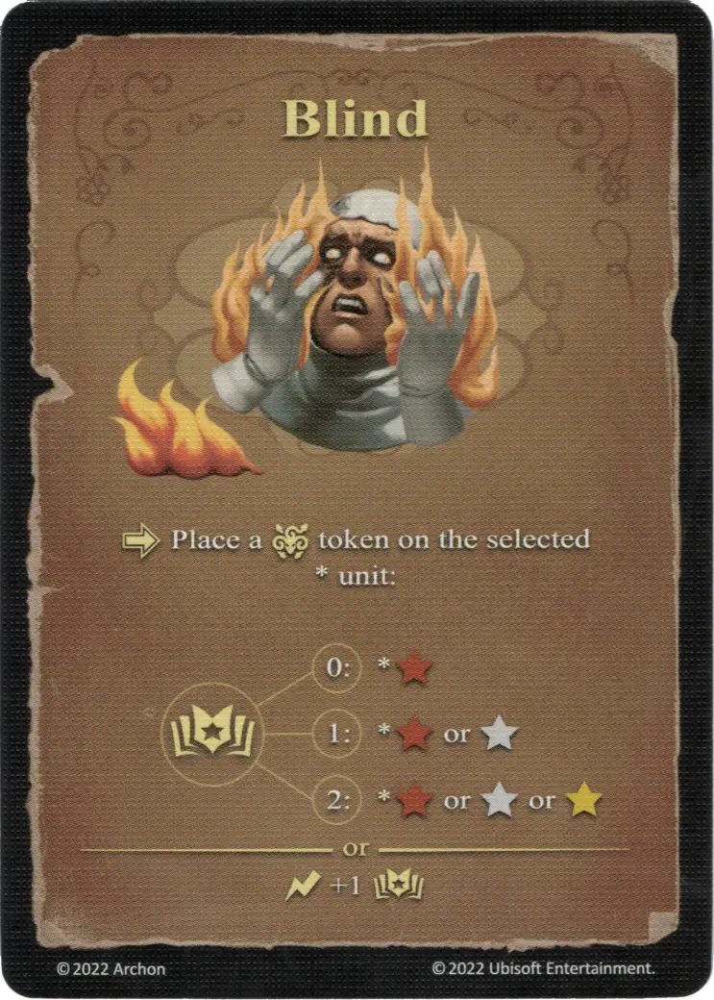

# Cegar

{ width="340" align=right }

___

[Hechizo Básico de Fuego](index.md#school-of-fire-magic)

___

:activation: Place a :paralysis: token on the selected \* [unit](../units/index.md):  :power: 0 ➣ \*:bronze_tier: :power: 1 ➣ \*:bronze_tier: or :silver_tier: :power: 2 ➣ \*:bronze_tier: or :silver_tier: or :gold_tier:  — OR —  :instant: +1 :power:

___

## Notas

- Ver [Parálisis](../keywords/paralysis.md)

## Viene Con

- [Juego Principal](../content/core_game.md)

## Ver También

- [Escuela de Magia Ígnea](index.md#school-of-fire-magic)
- [Lista de Hechizos](index.md)
