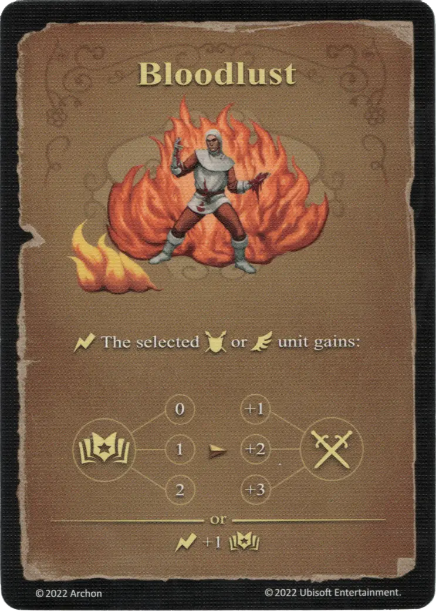

# Sed de Sangre

{ width="340" align=right }

___

[Hechizo Básico de Fuego](school_of_fire_magic.md)

___

:instant: La [unidad](../units/index.md) :unit_ground: o :unit_flying: seleccionada gana:  :empower: 0 ➣ +1 :attack: :empower: 1 ➣ +2 :attack: :empower: 2 ➣ +3 :attack:  — O —  :instant: +1 :empower:

___

## Viene Con

- [Juego Principal](../content/core_game.md)

## Ver También

- [Escuela de Magia Ígnea](school_of_fire_magic.md)
- [Lista de Hechizos](index.md)
