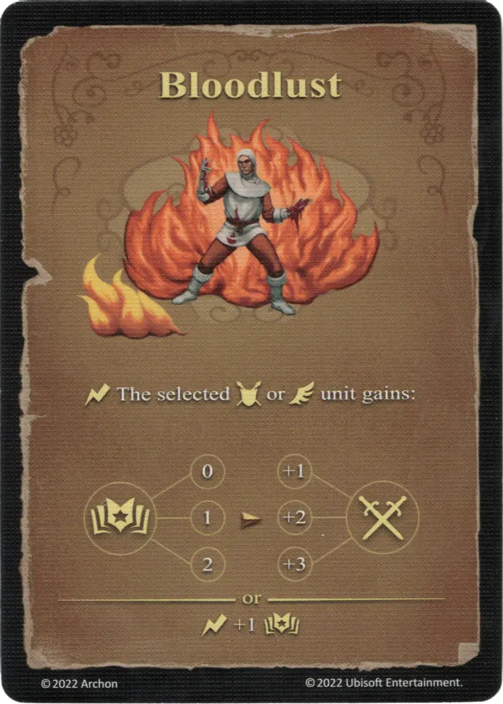

# Sed de Sangre

{ width="340" align=right }

___

[Hechizo Básico de Fuego](index.md#school-of-fire-magic)

___

:instant: The selected :ground_unit: or :flying_unit: [unit](../units/index.md) gains:  :power: 0 ➣ +1 :attack: :power: 1 ➣ +2 :attack: :power: 2 ➣ +3 :attack:  — OR —  :instant: +1 :power:

___

## Viene Con

- [Juego Principal](../content/core_game.md)

## Ver También

- [Escuela de Magia Ígnea](index.md#school-of-fire-magic)
- [Lista de Hechizos](index.md)
