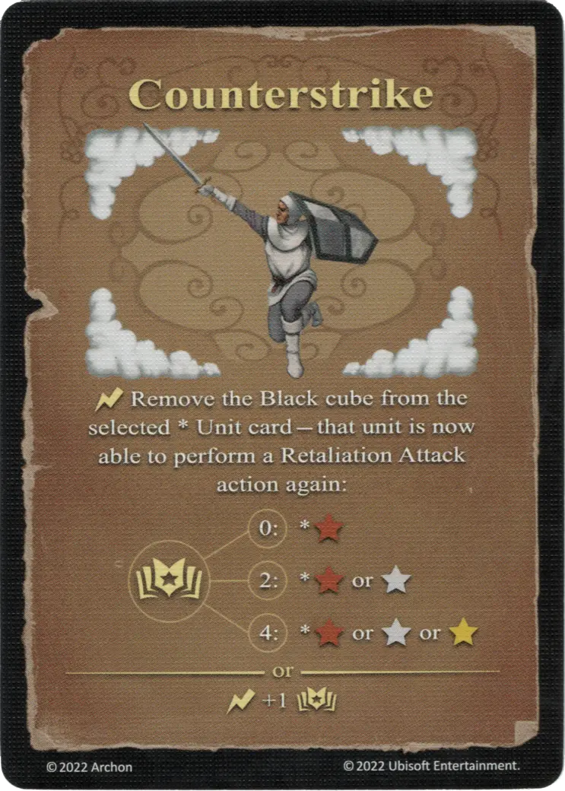

# Contraataque

{ width="340" align=right }

___

[Hechizo de Aire Experto](school_of_air_magic.md)

___

:instant: Retira el cubo Negro de la carta de [Unidad](../units/index.md) \* seleccionada - esa [unidad](../units/index.md) ya puede volver a realizar una acción de Ataque de Represalia:  :empower: 0 ➣ \*:bronze: :empower: 2 ➣ \*:bronze: or :silver: :empower: 4 ➣ \*:bronze: or :silver: or :golden:  — O —  :instant: +1 :empower:

___

## Viene Con

- [Juego Principal](../content/core_game.md)

## Ver También

- [Escuela de Magia Aérea](school_of_air_magic.md)
- [Lista de Hechizos](index.md)
