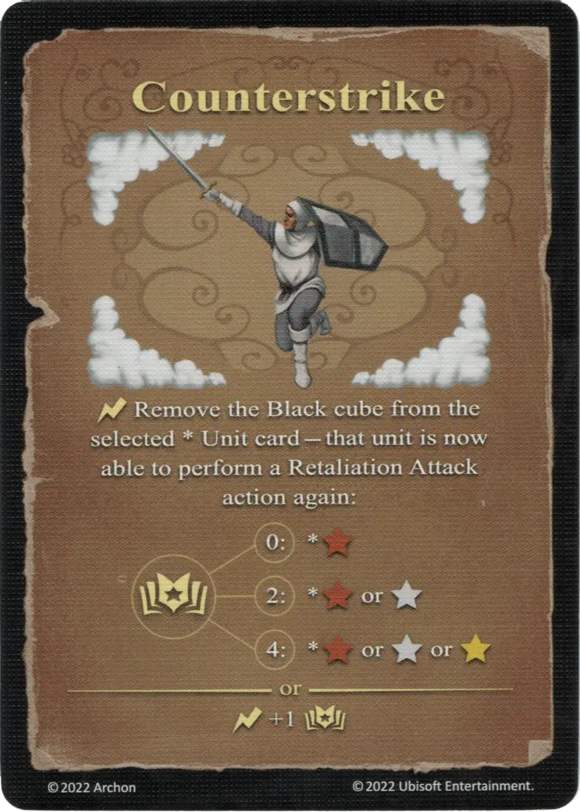

# Contraataque

{ width="340" align=right }

___

[Hechizo de Aire Experto](index.md#school-of-air-magic)

___

:instant: Remove the Black cube from the selected \* [Unit](../units/index.md) card - that [unit](../units/index.md) is now able to perform a Retaliation Attack action again:  :power: 0 ➣ \*:bronze_tier: :power: 2 ➣ \*:bronze_tier: or :silver_tier: :power: 4 ➣ \*:bronze_tier: or :silver_tier: or :gold_tier:  — OR —  :instant: +1 :power:

___

## Viene Con

- [Juego Principal](../content/core_game.md)

## Ver También

- [Escuela de Magia Aérea](index.md#school-of-air-magic)
- [Lista de Hechizos](index.md)
