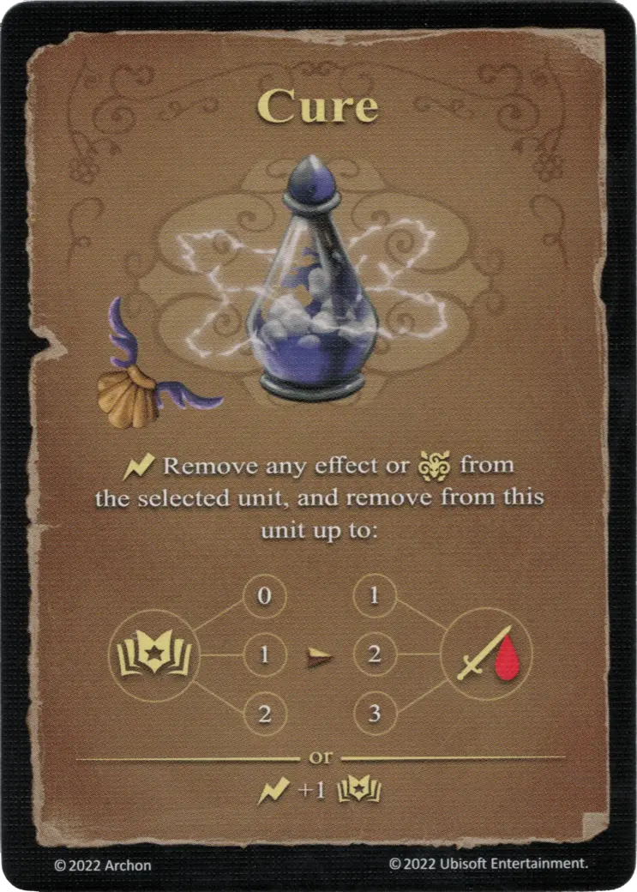

# Curar

{ width="340" align=right }

___

[Hechizo Básico de Agua](school_of_water_magic.md)

___

:instant: Retira cualquier efecto o :paralysis: de la [unidad](../units/index.md) seleccionada, y retira de esta [unidad](../units/index.md) hasta:  :empower: 0 ➣ 1 :damage: :empower: 1 ➣ 2 :damage: :empower: 2 ➣ 3 :damage:  — O —  :instant: +1 :empower:

___

## Notas

- [^1] No está claro qué se entiende aquí por «efecto».
- [^2] La curación sólo puede ser lanzada sobre una unidad aliada.
- [^2] La eliminación de un efecto es opcional. Un efecto positivo no tiene que ser eliminado y por lo tanto puede permanecer activo.

## Viene Con

- [Juego Principal](../content/core_game.md)

## Ver También

- [Escuela de Magia Acuática](school_of_water_magic.md)
- [Lista de Hechizos](index.md)

[^1]: Pregunta abierta que aún no tiene respuesta.
[^2]: No confirmado oficialmente por los diseñadores del juego, por lo que se considera una norma comunitaria.
