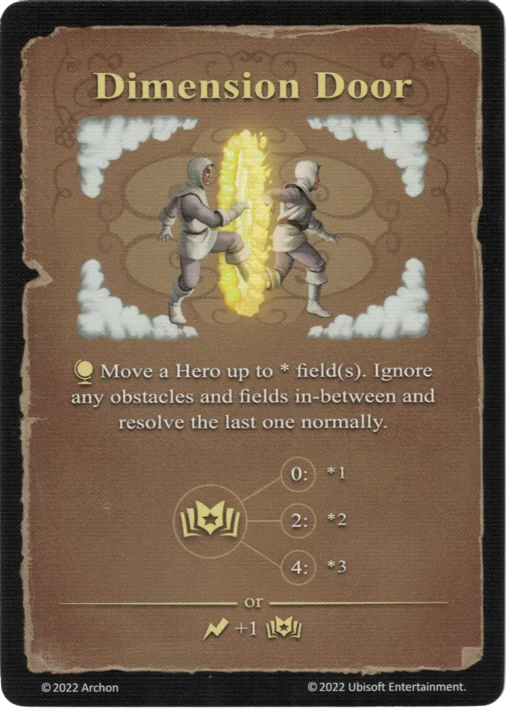

# Puerta Dimensional

{ width="340" align=right }

___

[Hechizo de Aire Experto](school_of_air_magic.md)

___

:effect_map: Mueve un [Héroe](../heroes/index.md) hasta \* zona(s). Ignora los obstáculos y zonas intermedias y resuelve la última con normalidad.  :empower: 0 ➣ \*1 :empower: 2 ➣ \*2 :empower: 4 ➣ \*3  — O —  :instant: +1 :empower:

___

## Notas

- La Puerta Dimensional sólo puede mover al Héroe del lanzador, no a un Héroe controlado por cualquier otro jugador.
- Puede utilizarse para saltar zonas bloqueadas.

## Viene Con

- [Expansión de Muralla](../content/rampart_expansion.md)

## Ver También

- [Escuela de Magia Aérea](school_of_air_magic.md)
- [Lista de Hechizos](index.md)
