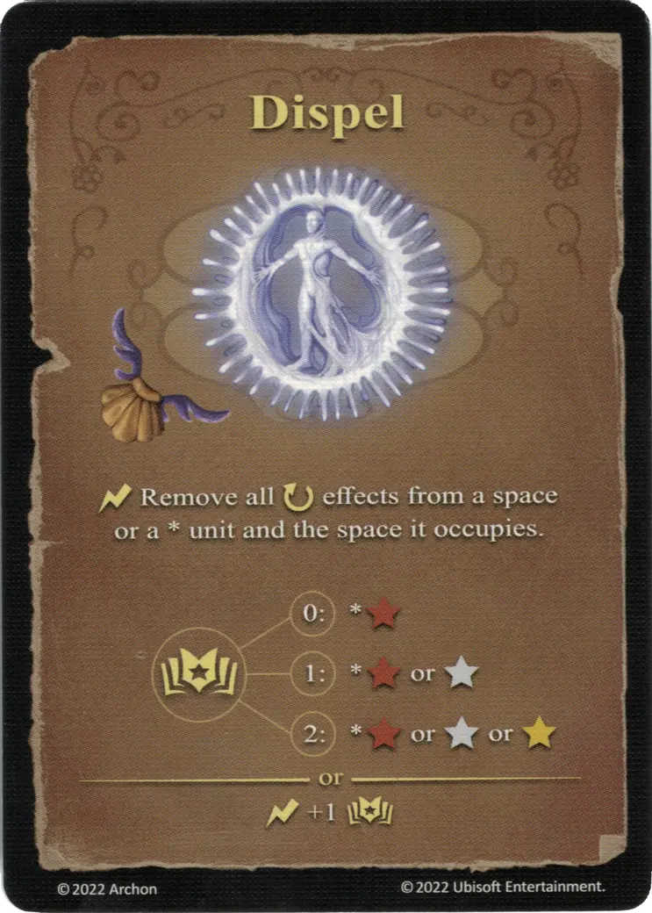

# Disipar

{ width="340" align=right }

___

[Hechizo Básico de Agua](school_of_water_magic.md)

___

:instant: Eliminar todos los efectos :ongoing: de una casilla o de una \* [unidad](../units/index.md) y de la casilla que ocupa.  :empower: 0 ➣ \*:bronze: :empower: 1 ➣ \*:bronze: o :silver: :empower: 2 ➣ \*:bronze: o :silver: o :golden:  — O —  :instant: +1 :empower:

___

## Notas

- Los efectos globales que no están vinculados a una unidad específica ( ej. Tiro con Arco) no pueden ser eliminados.

## Viene Con

- [Expansión de Torre](../content/tower_expansion.md)

## Ver También

- [Escuela de Magia Acuática](school_of_water_magic.md)
- [Lista de Hechizos](index.md)
