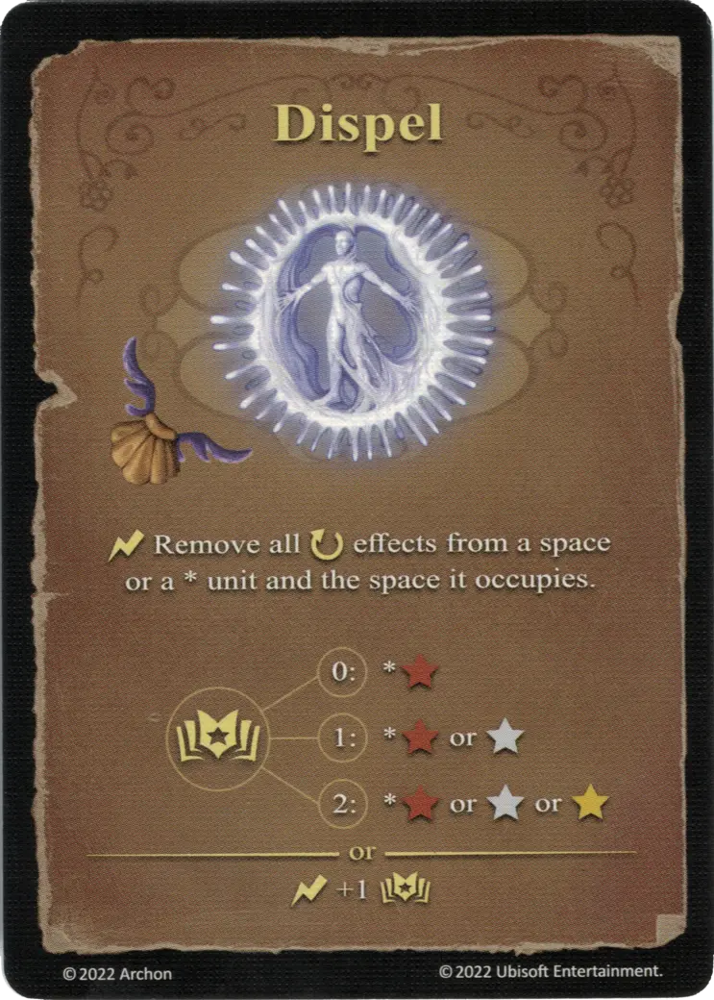

# Disipar

{ width="340" align=right }

___

[Hechizo Básico de Agua](index.md#school-of-water-magic)

___

:instant: Remove all :ongoing: effects from a space or a \* [unit](../units/index.md) and the space it occupies.  :power: 0 ➣ \*:bronze_tier: :power: 1 ➣ \*:bronze_tier: or :silver_tier: :power: 2 ➣ \*:bronze_tier: or :silver_tier: or :gold_tier:  — OR —  :instant: +1 :power:

___

## Notas

- Los efectos globales que no están vinculados a una unidad específica ( ej. Tiro con Arco) no pueden ser eliminados.

## Viene Con

- [Expansión de Torre](../content/tower_expansion.md)

## Ver También

- [Escuela de Magia Acuática](index.md#school-of-water-magic)
- [Lista de Hechizos](index.md)
