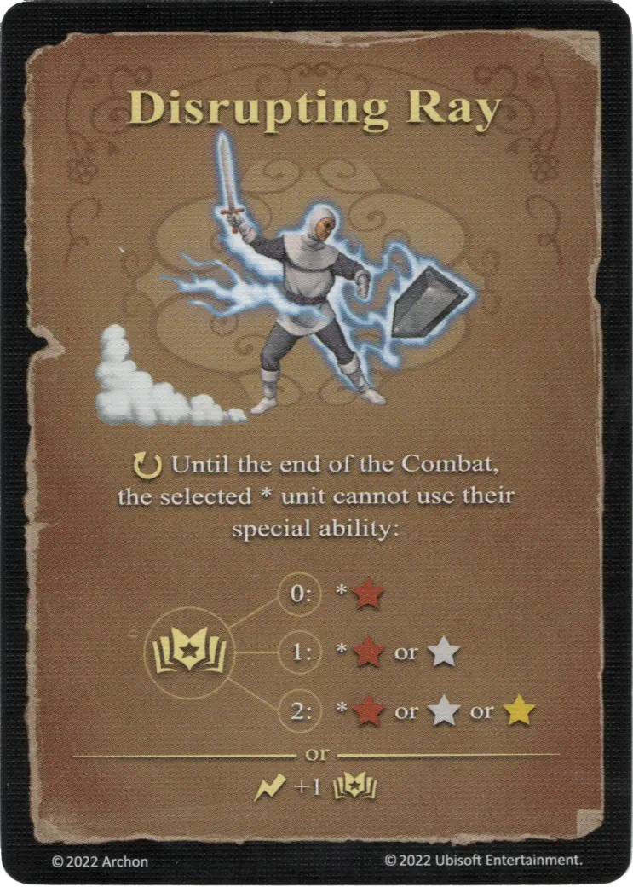

# Rayo Perturbador

{ width="340" align=right }

___

[Hechizo de Aire Básico](school_of_air_magic.md)

___

:ongoing: Hasta el final del Combate, la \*[unit](../units/index.md) seleccionada no puede usar su habilidad especial:  :empower: 0 ➣ \*:bronze: :empower: 1 ➣ \*:bronze: o :silver: :empower: 2 ➣ \*:bronze: o :silver: o :golden:  — O —  :instant: +1 :empower:

___

## Viene Con

- [Juego Principal](../content/core_game.md)

## Ver También

- [Escuela de Magia Aérea](school_of_air_magic.md)
- [Lista de Hechizos](index.md)
