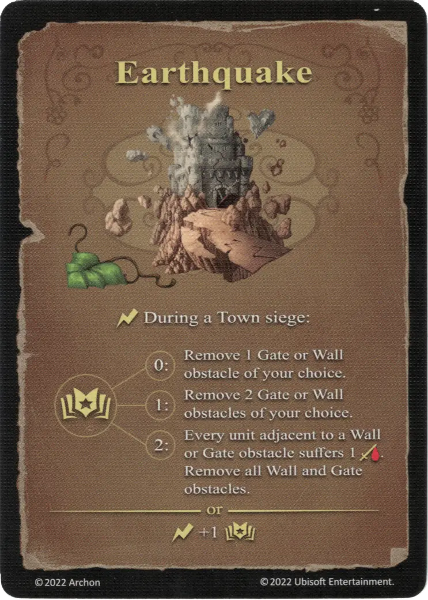

# Terremoto

{ width="340" align=right }

___

[Hechizo Básico de Tierra](school_of_earth_magic.md)

___

:instant: Durante un asedio de [Town](../towns/index.md):  :empower: 0 ➣ Elimina 1 obstáculo de Puerta o Muro a tu elección. :empower: 1 ➣ Elimina 2 obstáculos de Puerta o Muro a tu elección. :empower: 2 ➣ Cada [unidad](../units/index.md) adyacente a un obstáculo Muro o Puerta sufre 1 :damage:. Elimina todos los obstáculos de Puerta o Muro.  — O —  :instant: +1 :empower:

___

## Viene Con

- [Expansión de Muralla](../content/rampart_expansion.md)

## Ver También

- [Escuela de Magia Terrestre](school_of_earth_magic.md)
- [Lista de Hechizos](index.md)
