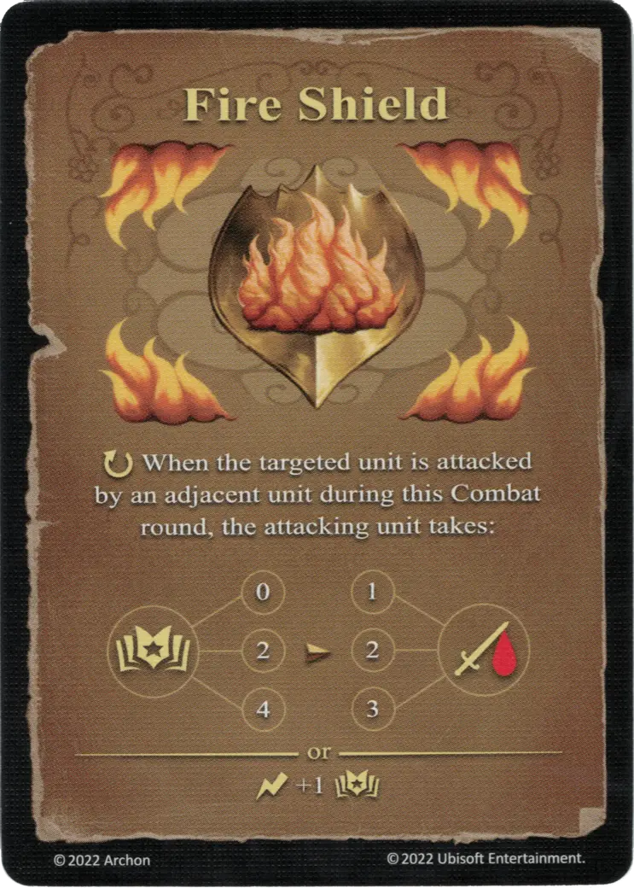

# Escudo de Fuego

{ width="340" align=right }

___

[Hechizo de Fuego Experto](school_of_fire_magic.md)

___

:ongoing: Cuando la [unidad] objetivo(../units/index.md) es atacada por una [unidad] adyacente(../units/index.md) durante esta ronda de Combate, la [unidad] atacante(../units/index.md) toma:  :empower: 0 ➣ 1 :damage: :empower: 2 ➣ 2 :damage: :empower: 4 ➣ 3 :damage:  — O —  :instant: +1 :empower:

___

## Notas

- La unidad atacante es dañada por el Escudo de Fuego incluso si derrota a la unidad que tiene Escudo de Fuego.

## Viene Con

- [Juego Principal](../content/core_game.md)

## Ver También

- [Escuela de Magia Ígnea](school_of_fire_magic.md)
- [Lista de Hechizos](index.md)
