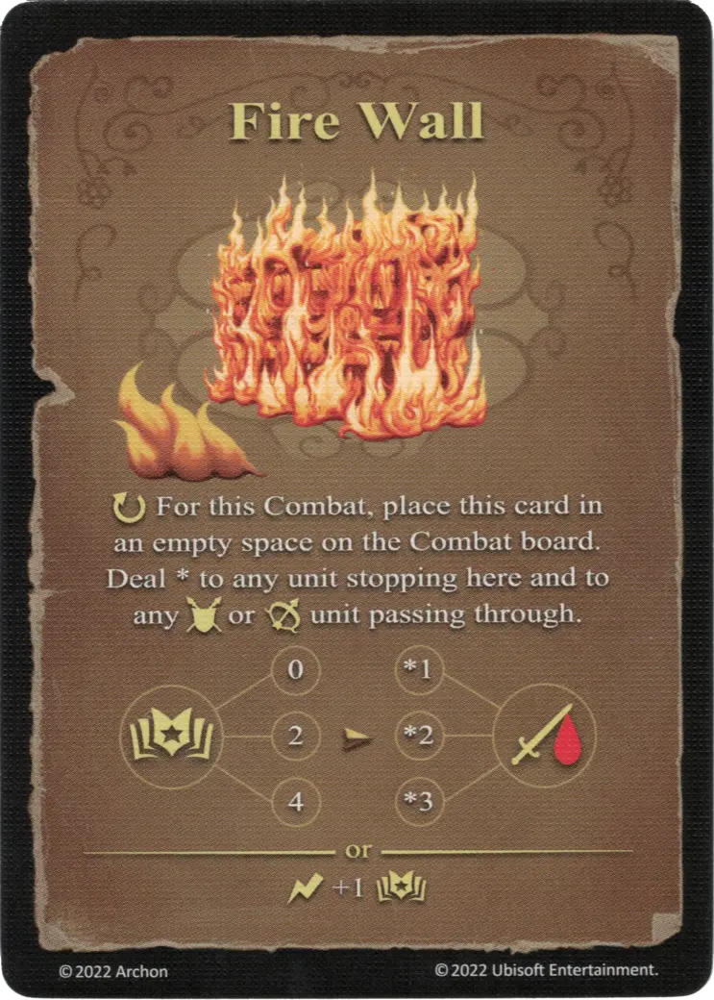

# Muro de Fuego

{ width="340" align=right }

___

[Hechizo Básico de Fuego](school_of_fire_magic.md)

___

:ongoing: Para este Combate, coloca esta carta en un espacio vacío del tablero de Combate. Inflige \* a cualquier [unidad](../units/index.md) que se detenga aquí y a cualquier [unidad](../units/index.md) :unit_ground: o :unit_ranged: que la atraviese.  :empower: 0 ➣ \*1 :damage: :empower: 2 ➣ \*2 :damage: :empower: 4 ➣ \*3 :damage:  — O —  :instant: +1 :empower:

___

## Notas

- [^1] En el campo de batalla grande, se coloca una ficha de Muro de Fuego en el campo de batalla en lugar de la carta.

## Viene Con

- [Expansión de Muralla](../content/rampart_expansion.md)

## Ver También

- [Escuela de Magia Ígnea](school_of_fire_magic.md)
- [Lista de Hechizos](index.md)

[^1]: Excepciones para modos de juego específicos. Esta explicación no es válida para todos los modos de juego. La variante específica para el modo de juego se menciona en el texto.
