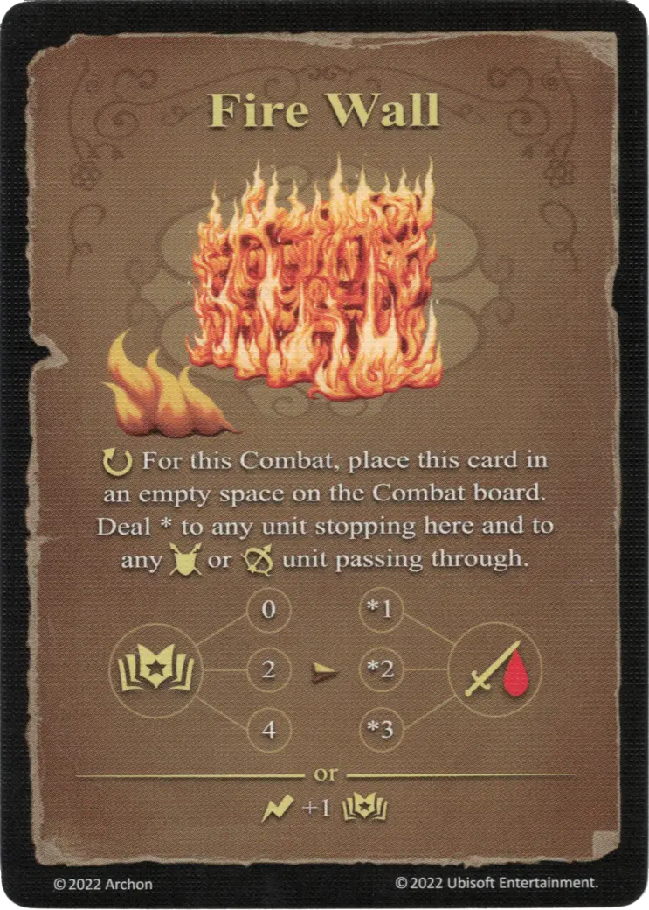

# Muro de Fuego

{ width="340" align=right }

___

[Hechizo Básico de Fuego](index.md#school-of-fire-magic)

___

:ongoing: For this Combat, place this card in an empty space on the Combat board. Deal \* to any [unit](../units/index.md) stopping here and to any :ground_unit: or :ranged_unit: [unit](../units/index.md) passing through.  :power: 0 ➣ \*1 :damage: :power: 2 ➣ \*2 :damage: :power: 4 ➣ \*3 :damage:  — OR —  :instant: +1 :power:

___

## Notas

- [^1] En el campo de batalla grande, se coloca una ficha de Muro de Fuego en el campo de batalla en lugar de la carta.

## Viene Con

- [Expansión de Muralla](../content/rampart_expansion.md)

## Ver También

- [Escuela de Magia Ígnea](index.md#school-of-fire-magic)
- [Lista de Hechizos](index.md)

[^1]: Excepciones para modos de juego específicos. Esta explicación no es válida para todos los modos de juego. La variante específica para el modo de juego se menciona en el texto.
