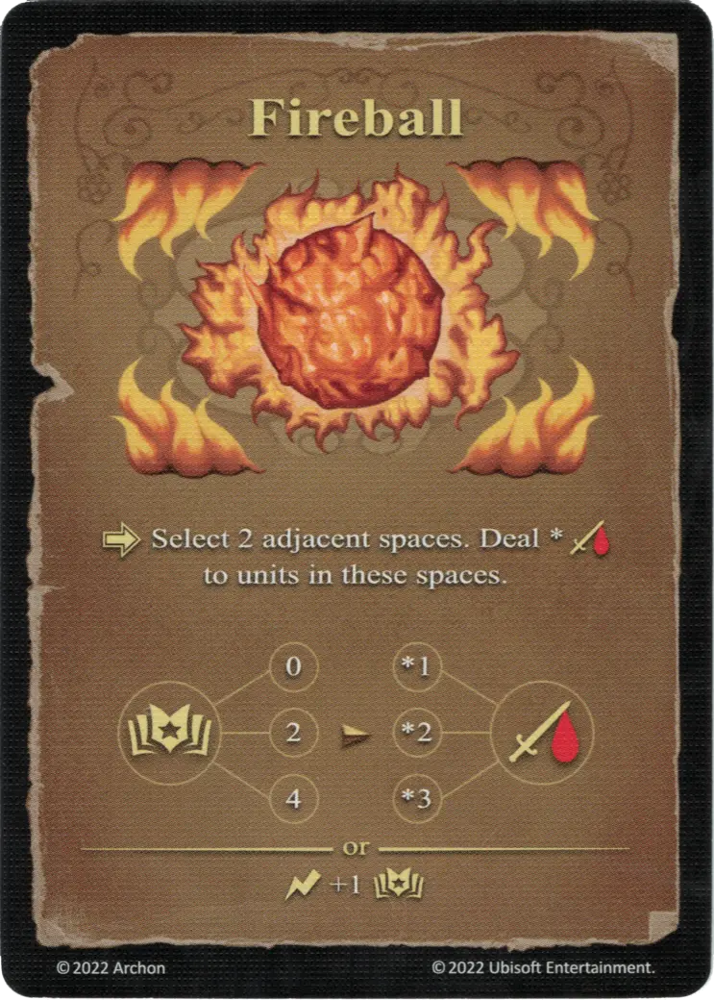

# Bola de Fuego

{ width="340" align=right }

___

[Hechizo de Fuego Experto](school_of_fire_magic.md)

___

:activation: Selecciona 2 espacios adyacentes. Inflige \* :daño: a [unidades](../units/index.md) en estos espacios.  :empower: 0 ➣ 1 :damage: :empower: 2 ➣ 2 :damage: :empower: 4 ➣ 3 :damage:  — O —  :instant: +1 :empower:

___

## Notas

- El :damage: de la Bola de Fuego también se aplica a las unidades aliadas.

## Viene Con

- [Juego Principal](../content/core_game.md)

## Ver También

- [Escuela de Magia Ígnea](school_of_fire_magic.md)
- [Lista de Hechizos](index.md)
