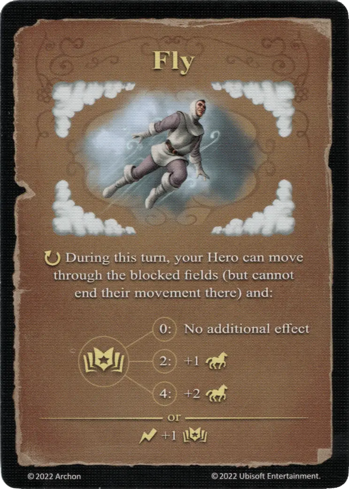

# Volar

{ width="340" align=right }

___

[Hechizo de Aire Experto](school_of_air_magic.md)

___

:ongoing: Durante este turno, tu [Héroe](../heroes/index.md) puede moverse a través de las zonas bloqueadas (pero no puede terminar su movimiento allí) y:  :empower: 0 ➣ No additional effect :empower: 2 ➣ +1 :movement: :empower: 4 ➣ +2 :movement:  — O —  :instant: +1 :empower:

___

## Viene Con

- [Expansión de Fortaleza](../content/fortress_expansion.md)

## Ver También

- [Escuela de Magia Aérea](school_of_air_magic.md)
- [Lista de Hechizos](index.md)
