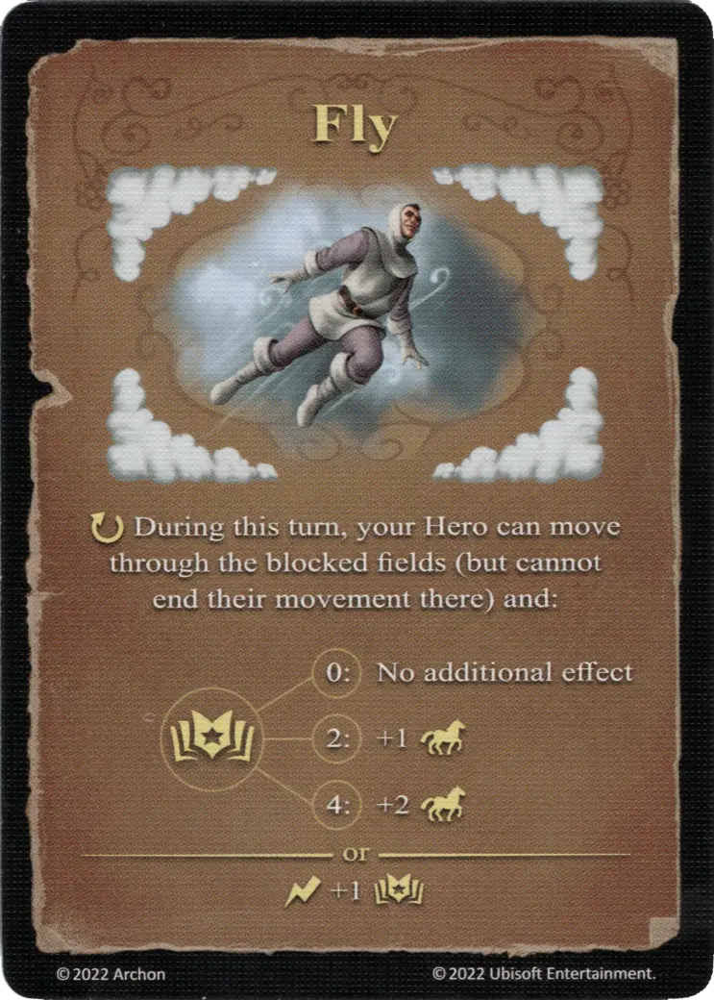

# Volar

{ width="340" align=right }

___

[Hechizo de Aire Experto](index.md#school-of-air-magic)

___

:ongoing: During this turn, your [Hero](../heroes/index.md) can move through the blocked fields (but cannot end their movement there) and:  :power: 0 ➣ No additional effect :power: 2 ➣ +1 :movement_points: :power: 4 ➣ +2 :movement_points:  — OR —  :instant: +1 :power:

___

## Viene Con

- [Expansión de Fortaleza](../content/fortress_expansion.md)

## Ver También

- [Escuela de Magia Aérea](index.md#school-of-air-magic)
- [Lista de Hechizos](index.md)
