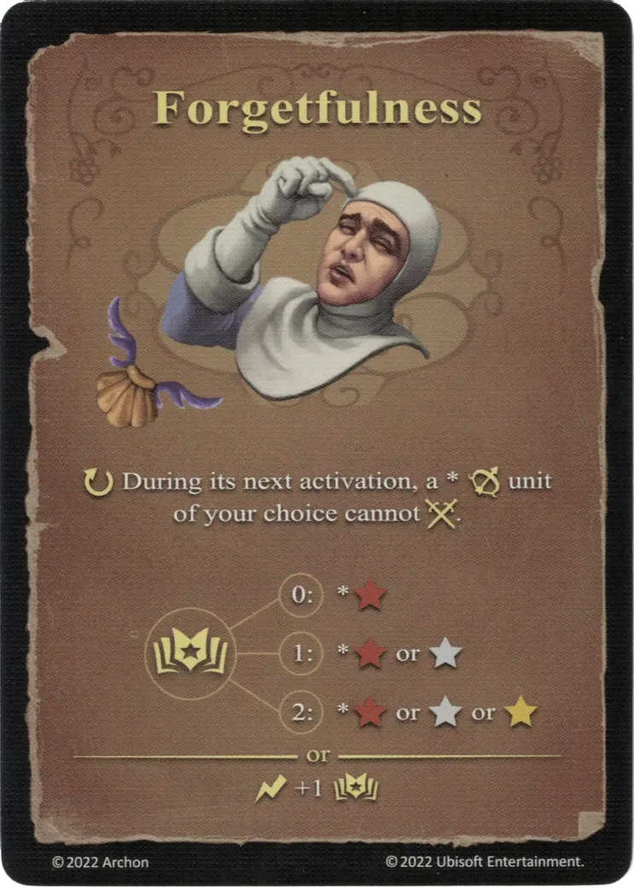

# Olvido

{ width="340" align=right }

___

[Hechizo Básico de Agua](school_of_water_magic.md)

___

:ongoing: Durante su próxima activación, una :unit_ranged: [unidad](../units/index.md) \* a su elección no puede :attack:.  :empower: 0 ➣ \*:bronze: :empower: 1 ➣ \*:bronze: or :silver: :empower: 2 ➣ \*:bronze: or :silver: or :golden:  — O —  :instant: +1 :empower:

___

## Viene Con

- [Expansión de Muralla](../content/rampart_expansion.md)

## Ver También

- [Escuela de Magia Acuática](school_of_water_magic.md)
- [Lista de Hechizos](index.md)
