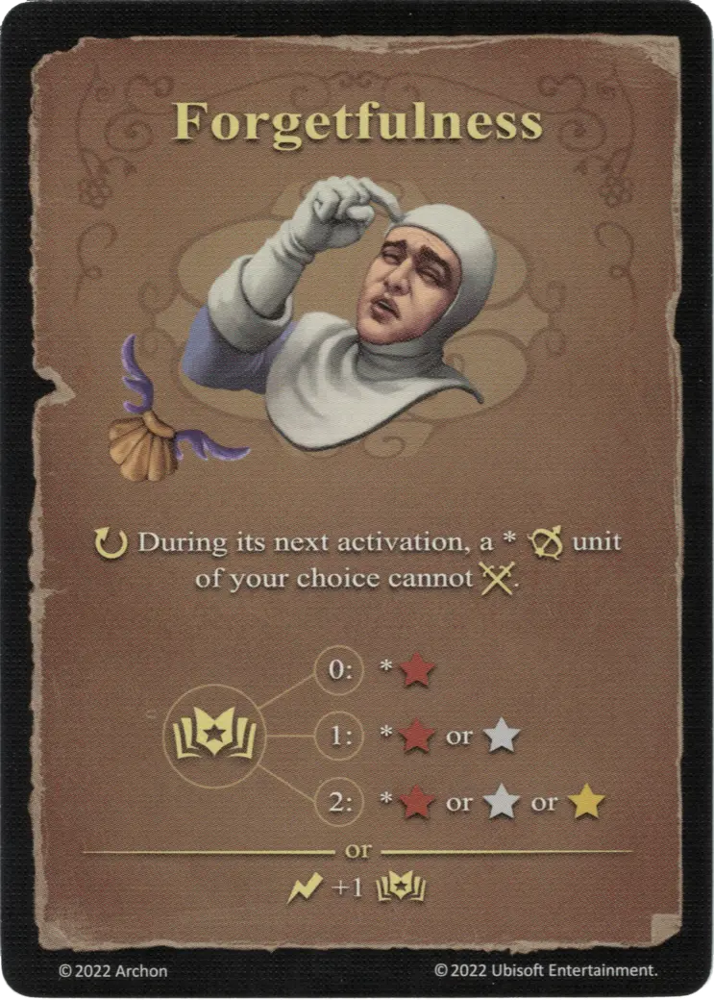

# Olvido

{ width="340" align=right }

___

[Hechizo Básico de Agua](index.md#school-of-water-magic)

___

:ongoing: During its next activation, a \* :ranged_unit: [unit](../units/index.md) of your choice cannot :attack:.  :power: 0 ➣ \*:bronze_tier: :power: 1 ➣ \*:bronze_tier: or :silver_tier: :power: 2 ➣ \*:bronze_tier: or :silver_tier: or :gold_tier:  — OR —  :instant: +1 :power:

___

## Viene Con

- [Expansión de Muralla](../content/rampart_expansion.md)

## Ver También

- [Escuela de Magia Acuática](index.md#school-of-water-magic)
- [Lista de Hechizos](index.md)
