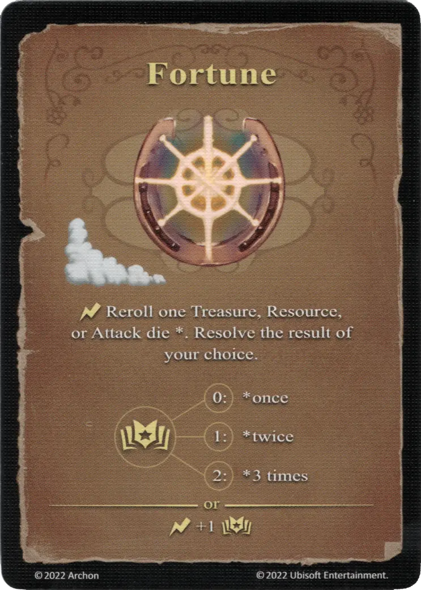

# Fortuna

{ width="340" align=right }

___

[Hechizo de Aire Básico](school_of_air_magic.md)

___

:instant: Vuelve a lanzar un dado de [Tesoro](../dice.md#treasure-die), [Recurso](../dice.md#resource-die), o [Ataque](../dice.md#attack-die) \*. Resuelve el resultado de tu elección  :empower: 0 ➣ \*once :empower: 1 ➣ \*twice :empower: 2 ➣ \*3 veces  — O —  :instant: +1 :empower:

___

## Notas

- Esta carta debe jugarse *antes* de lanzar el dado. No puede jugarse después de haber tirado el dado y de conocer el resultado de la tirada.

## Viene Con

- [Expansión de Fortaleza](../content/fortress_expansion.md)

## Ver También

- [Escuela de Magia Aérea](school_of_air_magic.md)
- [Lista de Hechizos](index.md)
