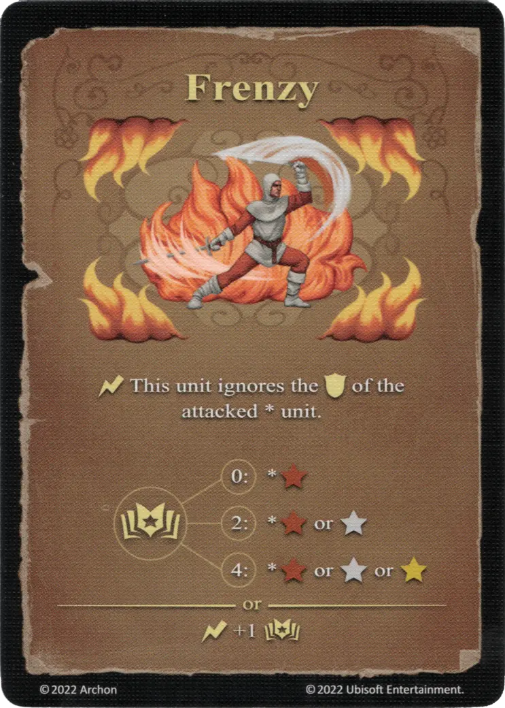

# Frenesí

{ width="340" align=right }

___

[Hechizo de Fuego Experto](school_of_fire_magic.md)

___

:instant: Esta [unidad](../units/index.md) ignora la :defense: de la [unidad](../units/index.md) atacada.  :empower: 0 ➣ \*:bronze: :empower: 2 ➣ \*:bronze: or :silver: :empower: 4 ➣ \*:bronze: o :silver: o :golden:  — O —  :instant: +1 :empower:

___

## Viene Con

- [Expansión de Fortaleza](../content/fortress_expansion.md)

## Ver También

- [Escuela de Magia Ígnea](school_of_fire_magic.md)
- [Lista de Hechizos](index.md)
