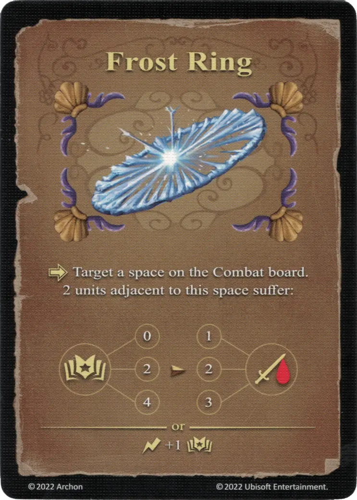

# Anillo Helado

{ width="340" align=right }

___

[Hechizo Experto de Agua](school_of_water_magic.md)

___

:activation: Selecciona un espacio en el tablero de Combate. 2 [unidades](../units/index.md) adyacentes a este espacio sufren:  :empower: 0 ➣ 1 :damage: :empower: 2 ➣ 2 :damage: :empower: 4 ➣ 3 :damage:  — O —  :instant: +1 :empower:

___

## Notas

- El :damage: de Anillo Helado también afecta a unidades aliadas.

## Viene Con

- [Expansión de Fortaleza](../content/fortress_expansion.md)

## Ver También

- [Escuela de Magia Acuática](school_of_water_magic.md)
- [Lista de Hechizos](index.md)
