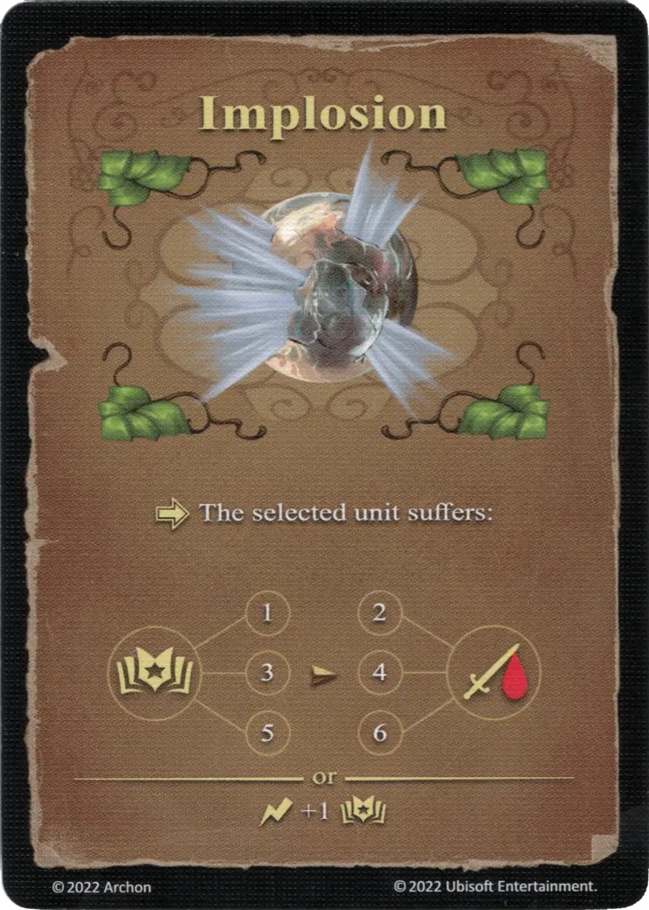

# Implosión

{ width="340" align=right }

___

[Hechizo de Tierra Experto](school_of_earth_magic.md)

___

:activation: La [unidad](../units/index.md) seleccionada sufre:  :empower: 1 ➣ 2 :damage: :empower: 3 ➣ 4 :damage: :empower: 5 ➣ 6:damage:  — O —  :instant: +1 :empower:

___

## Notas

- Para jugar este hechizo, es necesario jugar también al menos un poder de hechizo.

## Viene Con

- [Expansión de Fortaleza](../content/fortress_expansion.md)

## Ver También

- [Escuela de Magia Terrestre](school_of_earth_magic.md)
- [Lista de Hechizos](index.md)
