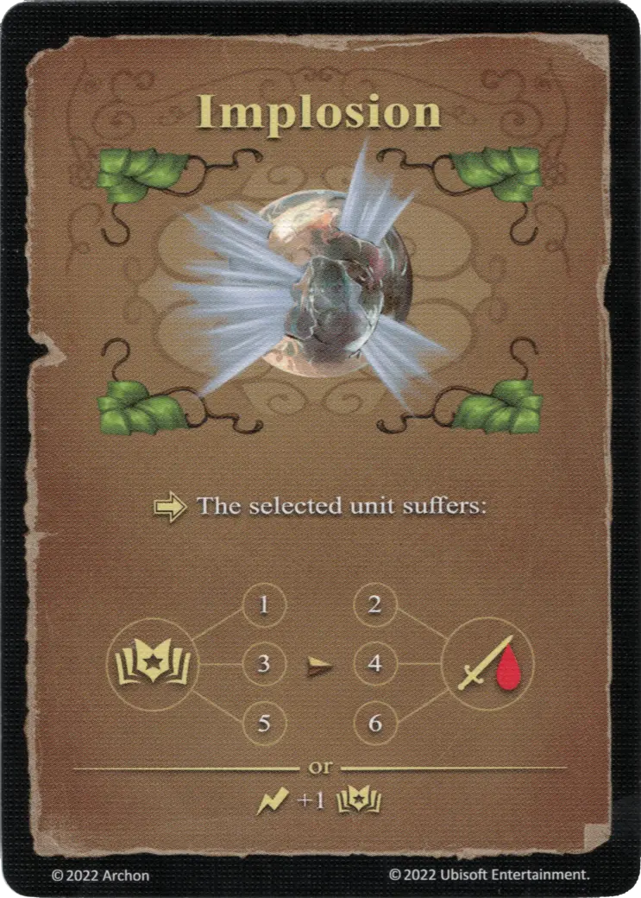

# Implosión

{ width="340" align=right }

___

[Hechizo de Tierra Experto](index.md#school-of-earth-magic)

___

:activation: La [unidad](../units/index.md) seleccionada sufre:  :power: 1 ➣ 2 :damage: :power: 3 ➣ 4 :damage: :power: 5 ➣ 6:damage:  — O —  :instant: +1 :power:

___

## Notas

- To play this spell, at least one spell power needs to also be played.

## Viene Con

- [Expansión de Fortaleza](../content/fortress_expansion.md)

## Ver También

- [Escuela de Magia Terrestre](index.md#school-of-earth-magic)
- [Lista de Hechizos](index.md)
