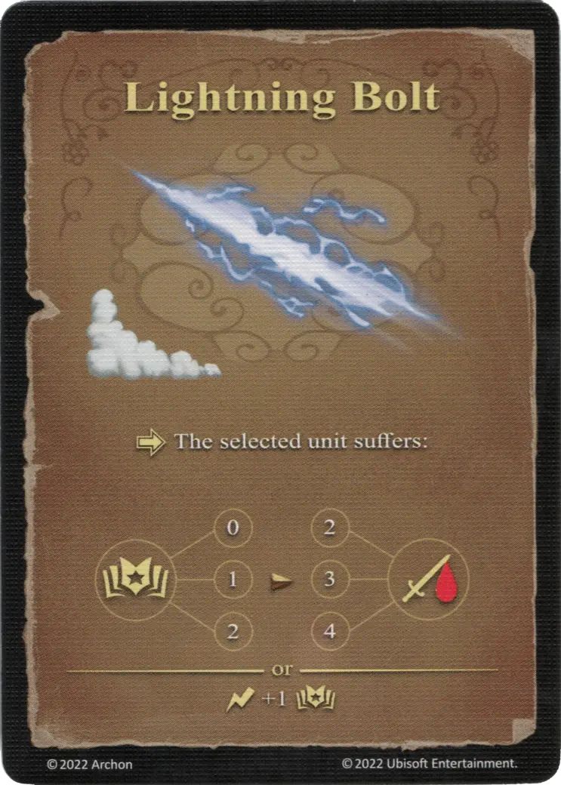

# Rayo

{ width="340" align=right }

___

[Hechizo de Aire Básico](school_of_air_magic.md)

___

:activation: The selected [unit](../units/index.md) suffers:  :empower: 0 ➣ 2 :damage: :empower: 1 ➣ 3 :damage: :empower: 2 ➣ 4 :damage:  — OR —  :instant: +1 :empower:

___

## Viene Con

- [Juego Principal](../content/core_game.md)

## Ver También

- [Escuela de Magia Aérea](school_of_air_magic.md)
- [Lista de Hechizos](index.md)
