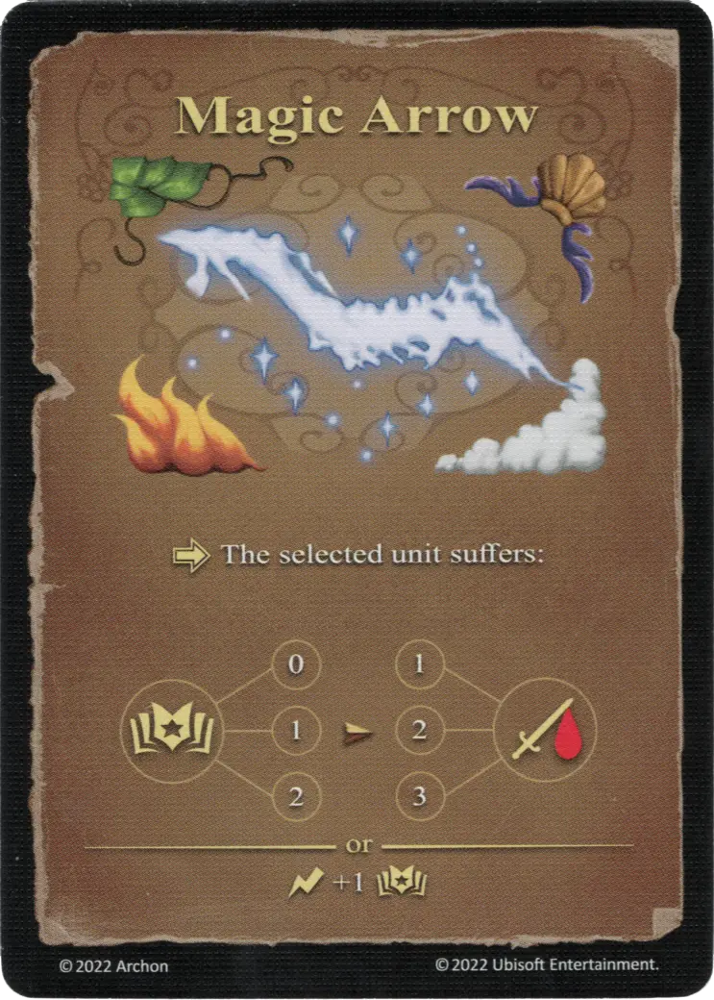

# Flecha mágica

{ width="340" align=right }

___

Basic Spell

___

:activation: The selected [unit](../units/index.md) suffers:  :empower: 0 ➣ 1 :damage: :empower: 1 ➣ 2 :damage: :empower: 2 ➣ 3 :damage:  — OR —  :instant: +1 :empower:

___

## Notas

- Magic Arrow se considera un hechizo básico, a pesar de tener un símbolo mágico en cada esquina.
- Magic Arrow puede beneficiarse de la bonificación de poder de hechizo a cualquier escuela de magia, pero solo puede verse afectada por una sola escuela de magia a la vez.
- [^1] Si una unidad ignora una escuela de magia específica (es inmune a los hechizos de esa escuela de magia), puede * no * ignorar la flecha mágica.

## Viene Con

- [Juego Principal](../content/core_game.md)
- [Expansión de Muralla](../content/rampart_expansion.md)
- [Expansión de Fortaleza](../content/fortress_expansion.md)
- [Expansión de Infierno](../content/inferno_expansion.md)

## Ver También

- [Escuela de Magia Aérea](school_of_air_magic.md)
- [Escuela de Magia Terrestre](school_of_earth_magic.md)
- [Escuela de Magia Ígnea](school_of_fire_magic.md)
- [Escuela de Magia Acuática](school_of_water_magic.md)
- [Lista de Hechizos](index.md)

[^1]: Not officially confirmed by game designers, and is therefore considered a Community rule.
