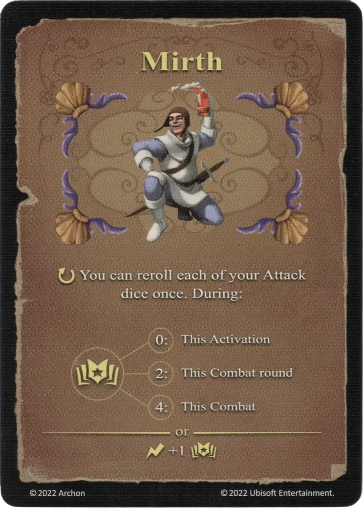

# Alegría

{ width="340" align=right }

___

[Hechizo Experto de Agua](school_of_water_magic.md)

___

:ongoing: You can reroll each of your [Attack dice](../keywords/dice.md#attack-die) once. During:  :empower: 0 ➣ This Activation :empower: 2 ➣ This Combat round :empower: 4 ➣ This Combat  — OR —  :instant: +1 :empower:

___

## Viene Con

- [Expansión de Muralla](../content/rampart_expansion.md)

## Ver También

- [Escuela de Magia Acuática](school_of_water_magic.md)
- [Lista de Hechizos](index.md)
