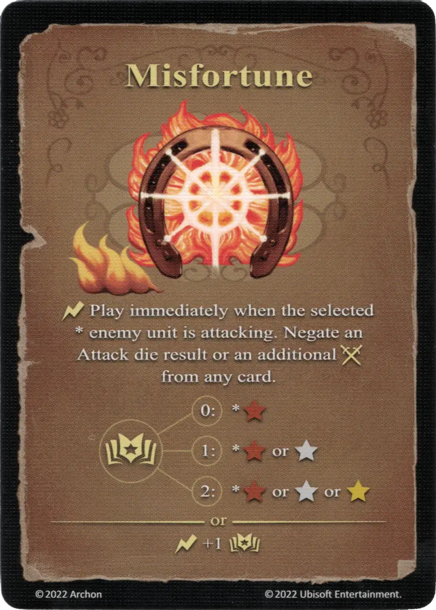

# Desgracia

{ width="340" align=right }

___

[Hechizo Básico de Fuego](index.md#school-of-fire-magic)

___

:instant: Play immediately when the selected \* enemy [unit](../units/index.md) is attacking. Negate an [Attack die](../keywords/dice.md#attack-die) result or an additional :attack: from any card.  :power: 0 ➣ \*:bronze: :power: 1 ➣ \*:bronze: or :silver: :power: 2 ➣ \*:bronze: or :silver: or :golden:  — OR —  :instant: +1 :power:

___

## Notas

- La carta debe jugarse inmediatamente después de declarar el ataque, antes de que se jueguen otras cartas.
- El resultado del ataque de ataque se niega, * así como * todos los efectos futuros que aumentan el: Ataque: de la unidad de ataque.
- La desgracia no se puede jugar para negar los efectos de las cartas que ya se jugaban y que ya han tenido: Attack: de la unidad de ataque.Los jugadores deben estar de acuerdo mutuamente si ya no pueden jugar una desgracia después de que se jugaron los otros efectos, o si el oponente toma su juego: Ataque: las cartas de aumento de la mano.

## Viene Con

- [Expansión de Fortaleza](../content/fortress_expansion.md)

## Ver También

- [Escuela de Magia Ígnea](index.md#school-of-fire-magic)
- [Lista de Hechizos](index.md)
