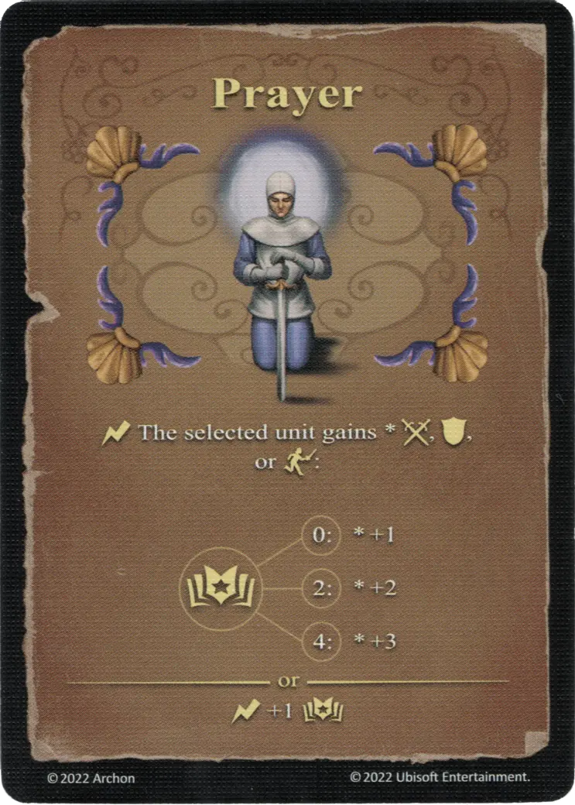

# Oración

{ width="340" align=right }

___

[Hechizo Experto de Agua](school_of_water_magic.md)

___

:instant: The selected [unit](../units/index.md) gains \* :attack:, :defense:, or :initiative::  :empower: 0 ➣ \*+1  :empower: 2 ➣ \*+2  :empower: 4 ➣ \*+3  — OR —  :instant: +1 :empower:

___

## Notas

- La oración solo aumenta uno de los tres valores, el lanzador puede elegir cuál.
- La oración se puede lanzar en cualquier momento durante el combate como un *instante *.De esta manera, un jugador puede aumentar la iniciativa de una unidad fuera de su turno, lo que hace que la orden de giro se ajuste de inmediato.

## Viene Con

- [Juego Principal](../content/core_game.md)

## Ver También

- [Escuela de Magia Acuática](school_of_water_magic.md)
- [Lista de Hechizos](index.md)
