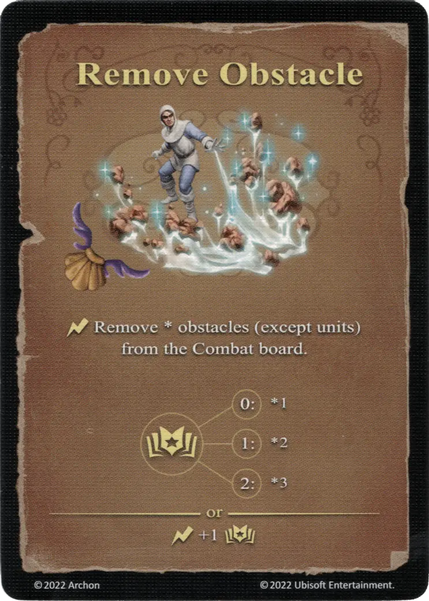

# Eliminar el obstáculo

{ width="340" align=right }

___

[Hechizo Básico de Agua](school_of_water_magic.md)

___

:instant: Remove \* obstacles (except [units](../units/index.md)) from the Combat board.  :empower: 0 ➣ \*1 :empower: 1 ➣ \*2 :empower: 2 ➣ \*3  — OR —  :instant: +1 :empower:

___

## Notas

- Este hechizo no puede eliminar las unidades, a pesar de contar como obstáculos para fines de movimiento.
- Solo el muro, la puerta y los marcadores de obstáculos (en el gran campo de batalla) pueden eliminarse por este hechizo.

## Viene Con

- [Expansión de Fortaleza](../content/fortress_expansion.md)

## Ver También

- [Escuela de Magia Acuática](school_of_water_magic.md)
- [Lista de Hechizos](index.md)
