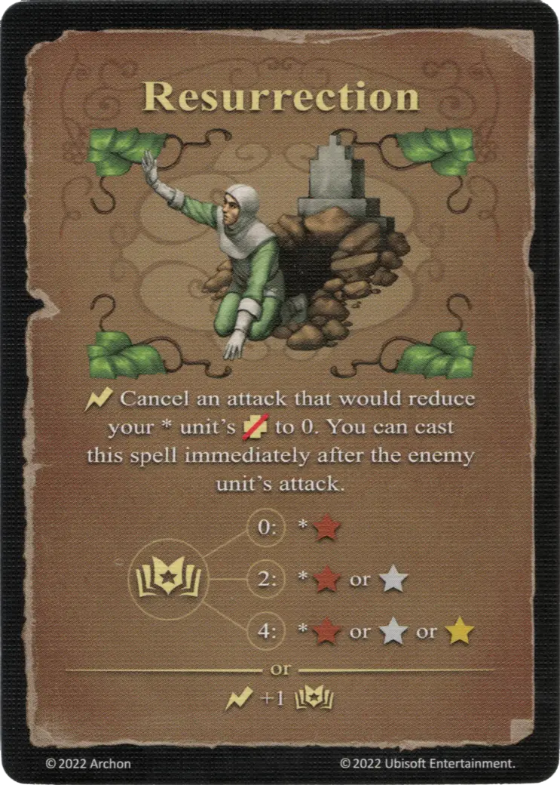

# Resurrección

{ width="340" align=right }

___

[Hechizo de Tierra Experto](school_of_earth_magic.md)

___

:instant: Cancel an attack that would reduce your \* [unit's](../units/index.md) :health_points: to 0. You can cast this spell immediately after the enemy [unit's](../units/index.md) attack.  :empower: 0 ➣ \*:bronze: :empower: 2 ➣ \*:bronze: or :silver: :empower: 4 ➣ \*:bronze: or :silver: or :golden:  — OR —  :instant: +1 :empower:

___

## Notas

- Solo el daño de un ataque puede ser anulado.Si los puntos de salud se reducen por otros medios de daño (como habilidades, hechizos, especialidades, etc.), no se puede jugar la resurrección.
- Si el daño de un ataque se anula, la unidad resucitada no tomará represalias, incluso si no ha realizado una represalia en esta ronda.

## Viene Con

- [Juego Principal](../content/core_game.md)

## Ver También

- [Escuela de Magia Terrestre](school_of_earth_magic.md)
- [Lista de Hechizos](index.md)
