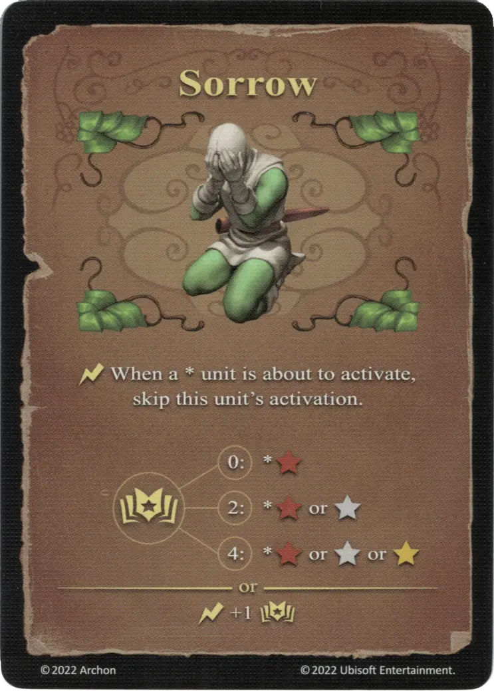

# Pena

{ width="340" align=right }

___

[Hechizo de Tierra Experto](school_of_earth_magic.md)

___

:instant: When a \* [unit](../units/index.md) is about to activate, skip this [unit's](../units/index.md) activation.  :empower: 0 ➣ \*:bronze: :empower: 2 ➣ \*:bronze: or :silver: :empower: 4 ➣ \*:bronze: or :silver: or :golden:  — OR —  :instant: +1 :empower:

___

## Viene Con

- [Expansión de Muralla](../content/rampart_expansion.md)

## Ver También

- [Escuela de Magia Terrestre](school_of_earth_magic.md)
- [Lista de Hechizos](index.md)
