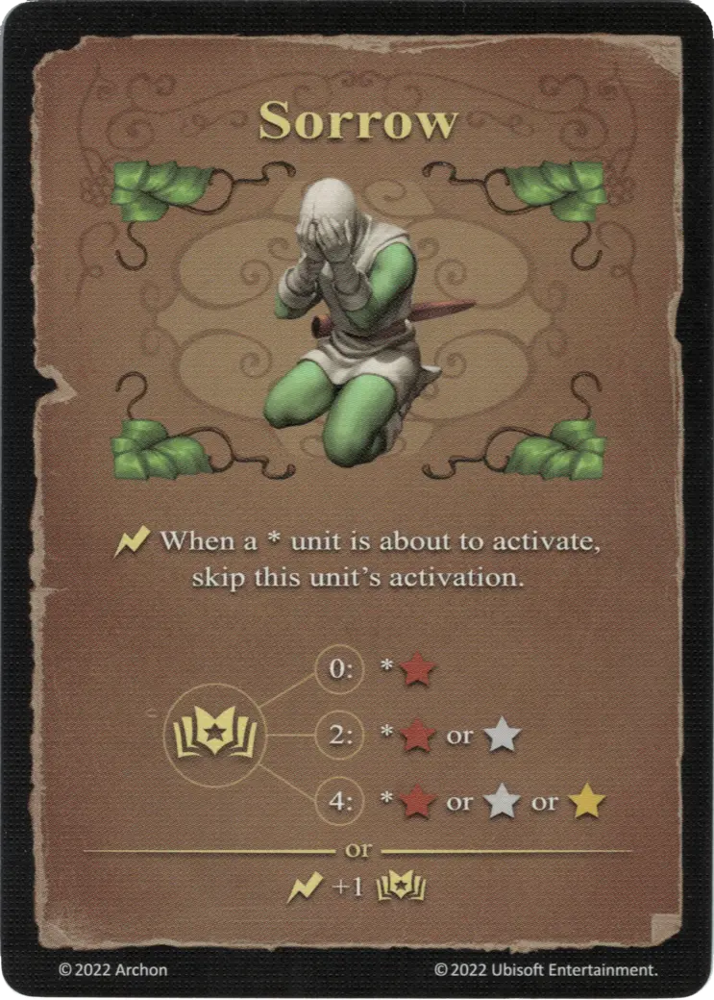

# Pena

{ width="340" align=right }

___

[Hechizo de Tierra Experto](index.md#school-of-earth-magic)

___

:instant: When a \* [unit](../units/index.md) is about to activate, skip this [unit's](../units/index.md) activation.  :power: 0 ➣ \*:bronze_tier: :power: 2 ➣ \*:bronze_tier: or :silver_tier: :power: 4 ➣ \*:bronze_tier: or :silver_tier: or :gold_tier:  — OR —  :instant: +1 :power:

___

## Viene Con

- [Expansión de Muralla](../content/rampart_expansion.md)

## Ver También

- [Escuela de Magia Terrestre](index.md#school-of-earth-magic)
- [Lista de Hechizos](index.md)
