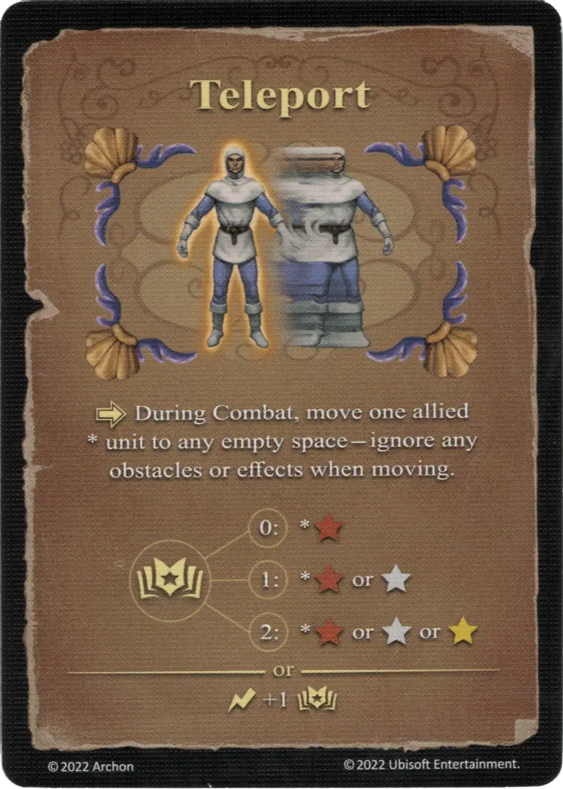

# Teletransporte

{ width="340" align=right }

___

[Hechizo Experto de Agua](school_of_water_magic.md)

___

:activation: During Combat, move one allied \* [unit](../units/index.md) to any empty space - ignore any obstacles or effects when moving.  :empower: 0 ➣ \*:bronze: :empower: 1 ➣ \*:bronze: or :silver: :empower: 2 ➣ \*:bronze: or :silver: or :golden:  — OR —  :instant: +1 :empower:

___

## Viene Con

- [Juego Principal](../content/core_game.md)

## Ver También

- [Escuela de Magia Acuática](school_of_water_magic.md)
- [Lista de Hechizos](index.md)
