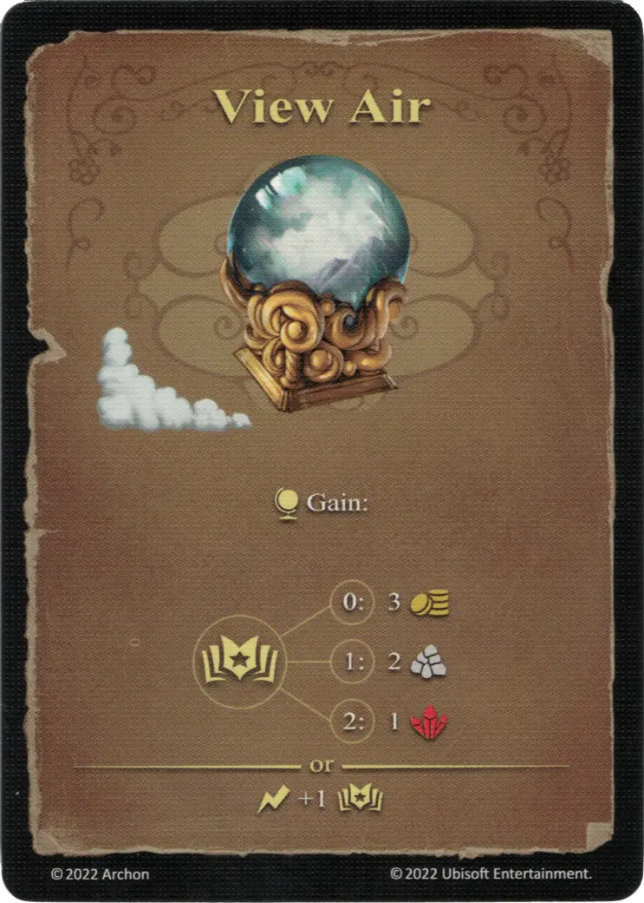

# Ver el aire

{ width="340" align=right }

___

[Hechizo de Aire Básico](school_of_air_magic.md)

___

:effect_map: Gain:  :empower: 0 ➣ 3 :gold: :empower: 1 ➣ 2 :building_materials: :empower: 2 ➣ 1 :valuables:  — OR —  :instant: +1 :empower:

___

## Viene Con

- [Expansión de Torre](../content/tower_expansion.md)

## Ver También

- [Escuela de Magia Aérea](school_of_air_magic.md)
- [Lista de Hechizos](index.md)
